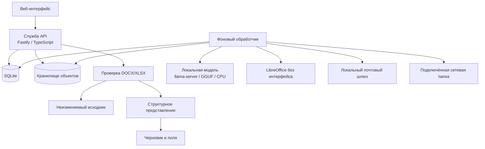

# 🧩 Docomator

**Автономная платформа для подключения, заполнения, автоматического формирования и доставки документов DOCX/XLSX с локальной поддержкой ИИ.**

**Текущее состояние:** работают универсальные данные, изолированные пространства, аудитории, русскоязычный интерфейс, безопасная проверка и хранение исходников, структурный анализ DOCX/XLSX, черновики шаблонов и проверяемые скалярные поля. Следующий этап — детерминированная техническая привязка поля в OOXML и пробное заполнение.  
**Среда:** Node.js 24 LTS, TypeScript, SQLite, `llama.cpp`, Debian/Astra Linux, работа без доступа в Интернет.

> [!IMPORTANT]
> Docomator пока не является завершённой системой формирования документов. Разметка поля уже сохраняется и повторно проверяется сервером, но физическое изменение DOCX/XLSX и выпуск готового документа ещё относятся к следующим этапам.

## 🎯 Назначение

Docomator должен позволять пользователю без навыков программирования:

- загрузить поддерживаемый DOCX или XLSX;
- проверить файл до сохранения и увидеть понятные замечания;
- сохранить прошедший проверку исходник в выбранном пространстве;
- увидеть абзацы DOCX, текстовые фрагменты, листы, ячейки и формулы XLSX;
- выбрать изменяемое место и сохранить его как типизированное поле;
- связать поле с произвольными сведениями о людях, организациях и других объектах;
- добавлять новые параметры: рост, вес, количество животных, реквизиты, должность и другие свойства;
- выбрать всех участников, сохранённую группу или отмеченных вручную людей;
- сформировать **один общий документ с таблицей/списком** либо **отдельный документ для каждого участника**;
- создавать документы вручную, по событию или расписанию;
- проверять результат, архивировать и доставлять его по разрешённым каналам;
- работать полностью автономно на центральном процессоре.

> [!NOTE]
> Локальная модель будет предлагать поля, форматирование и текстовые блоки. Файлы, БД, вычисления, расписания и доставка изменяются только проверенным серверным кодом.

## 🧭 Состояние разработки

| Подсистема | Состояние | Реализовано |
|---|---:|---|
| Основа проекта | ✅ | рабочие области npm, строгий TypeScript, служба API, фоновый обработчик |
| Хранение | ✅ | SQLite, типизированные значения, хранилище объектов, очередь, события и аудит |
| Резервирование | ✅ | проверяемое резервное копирование, восстановление и откат |
| Пространства | ✅ | изоляция данных, участников, исходников и черновиков |
| Группы и аудитории | ✅ | группы, разовый выбор, неизменяемые снимки, расчёт числа документов |
| Русский пользовательский слой | ✅ | русский словарь, ошибки, подсказки и автоматическая проверка терминологии |
| Безопасный приём и структура | ✅ | проверка пакета, карантин, абзацы DOCX, листы, ячейки и формулы XLSX |
| Черновики и поля | ✅ | серверная координата, тип, обязательность, SHA-256 структуры, защита от повторов |
| Веб-интерфейс | 🟡 | автономная оболочка, база знаний, пространства, шаблоны, помощь и явные состояния |
| Автономная поставка | 🟡 | комплект, SHA-256, установка, обновление, откат и помощник первого запуска |
| Компилятор шаблонов | ⬜ | следующий этап: `w:sdt`, именованные привязки и пробное заполнение |
| Формирование DOCX/XLSX | ⬜ | запланировано |
| Расписания и события | 🟡 | очередь и журнал событий готовы; планировщик ещё не реализован |
| Электронная почта и сетевая папка | ⬜ | требования зафиксированы |

Подробности: [план развития](docs/ROADMAP.md), [план реализации](docs/IMPLEMENTATION_PLAN.md), [ближайшие приращения](docs/NEXT_ITERATIONS.md) и [требования](docs/REQUIREMENTS.md).

## 👥 Пространства, группы и аудитории

В разделе **«Пространства»** уже можно:

- 🧑‍🤝‍🧑 создать отдельный контур подразделения, проекта или заказчика;
- 👥 добавить участников только в выбранное пространство;
- ☑️ отметить произвольных людей;
- 🗃️ сохранить выбор как именованную группу;
- 📸 зафиксировать неизменяемый снимок состава;
- 📄 выбрать «по документу на каждого»;
- 📋 выбрать «один общий документ» с таблицей или списком всех участников.

```text
все активные / сохранённая группа / отмеченные люди
                         ↓
              неизменяемый снимок состава
                 ↙                     ↘
несколько документов              один общий документ
по одному на человека             таблица или список
```

> [!NOTE]
> Состав аудитории и точное число будущих документов уже рассчитываются. Фактическая повторяющаяся таблица для `audience.members` будет добавлена после скалярного компилятора.

Технический контракт: [пространства и аудитории](docs/SPACES_AND_AUDIENCES.md).

## 🛡️ От файла до проверяемого поля

Рабочая последовательность в разделе **«Шаблоны»**:

```text
1. Выбрать DOCX/XLSX
2. Проверить безопасность
3. Выбрать пространство и сохранить исходник
4. Построить структурное представление
5. Выбрать абзац или ячейку
6. Указать название, ключ, тип и обязательность
7. Сохранить поле
```

### Проверка до сохранения

Проверяются:

- сигнатура и обязательные части Office Open XML;
- исходный и распакованный размер;
- число частей и степень сжатия;
- опасные пути, дубликаты, шифрование и символические ссылки;
- макросы, ActiveX, OLE, цифровые подписи и внешние связи;
- запрещённые объявления `DOCTYPE` и `ENTITY`.

Результат имеет одно из трёх понятных состояний:

- ✅ **структура прошла проверку**;
- ⚠️ **файл принят с замечаниями**;
- ⛔ **файл нельзя использовать**.

Проверка сама по себе не сохраняет файл. Сохранение выполняется только после отдельного подтверждения.

### Неизменяемый исходник

После подтверждения сервер повторно проверяет файл, рассчитывает SHA-256 и сохраняет его в адресуемом по содержимому хранилище. Одинаковый файл не дублируется. Запись принадлежит одному пространству и недоступна из другого.

### Структурное представление

Система возвращает только безопасные данные:

- DOCX: основной текст, колонтитулы, сноски, абзацы, текстовые фрагменты и положение внутри таблицы;
- XLSX: листы, адреса ячеек, значения, типы и формулы;
- устойчивый идентификатор элемента;
- SHA-256 структурного представления;
- итоговые количества и признак сокращённого показа.

Исходный XML в браузер не передаётся.

### Проверяемое поле

Для выбранного элемента пользователь задаёт:

- понятное название;
- технический ключ;
- тип значения;
- обязательность.

Сервер не доверяет координате из браузера. Он повторно читает сохранённый исходник, строит структуру и сам получает координату по `elementId`. В поле фиксируются:

```text
source_sha256
structure_sha256
element_id
вид элемента
путь части / лист
номер абзаца или адрес ячейки
исходный фрагмент
```

Один структурный элемент не может иметь две скалярные привязки, а одинаковый ключ не создаётся повторно.

Технический контракт: [безопасный приём DOCX/XLSX](docs/DOCUMENT_INTAKE.md).

## 🧱 Следующий вертикальный шаг

Продолжение выполняется без локальной модели:

1. проверить `source_sha256` и `structure_sha256` перед изменением;
2. создать для DOCX элемент управления содержимым `w:sdt`;
3. создать для XLSX именованную привязку;
4. сохранить нетронутые части пакета;
5. повторно открыть результат и найти созданную привязку;
6. вставить пробное значение и считать его обратно;
7. сохранить неизменяемую версию шаблона;
8. затем добавить повторяющийся блок для `audience.members`.

Полная декомпозиция: [ближайшие приращения](docs/NEXT_ITERATIONS.md).

## ✨ Интерфейс без догадок

После запуска откройте:

```text
http://127.0.0.1:8080/
```

Основной принцип: **пользователь всегда понимает, что происходит, почему требуется ожидание и что делать дальше**.

- 🏠 обзор готовности и следующий полезный шаг;
- 🧑‍🤝‍🧑 пространства, участники и группы;
- 🗂️ типы и свойства данных;
- 🛡️ проверка документа с отдельным подтверждением сохранения;
- 🧭 список абзацев и ячеек с устойчивыми координатами;
- 🏷️ форма поля с пояснениями под каждым нетривиальным значением;
- ⏳ конкретное название текущей операции;
- ✅ успех только после ответа сервера;
- ⚠️ исправимая ошибка с сохранёнными данными и идентификатором операции;
- 💡 контекстная помощь и ответы на частые вопросы;
- 📱 адаптивная навигация для компьютера и телефона;
- 🌗 светлая, тёмная и системная темы;
- ♿ клавиатура, видимый фокус и уменьшение анимации;
- 🔒 отсутствие внешних шрифтов, аналитики и сетевых зависимостей.

> [!IMPORTANT]
> Пользовательские сообщения пишутся по-русски. Машинные ключи показываются только там, где они действительно нужны, и сопровождаются русским пояснением.

Подробный контракт: [ТЗ на интерфейс](docs/UX_UI_SPECIFICATION.md).

## 🏗️ Архитектура



Проект остаётся **модульным монолитом**. В рабочем контуре запускаются:

```text
docomator-api
docomator-worker
docomator-llm
```

Redis, RabbitMQ, Kafka, Kubernetes и отдельная векторная база не являются обязательными.

Подробнее: [архитектура](docs/ARCHITECTURE.md) и [решения ADR](docs/adr/).

## 🚀 Запуск для разработки

Требуются Node.js из [`.node-version`](.node-version) и npm 11+.

```bash
npm ci
npm run check

export DOCOMATOR_DATA_DIR="$PWD/.tmp/data"
npm run migrate
npm run build
npm run start:api
```

Во втором терминале:

```bash
export DOCOMATOR_DATA_DIR="$PWD/.tmp/data"
npm run start:worker
```

Проверка:

```bash
curl http://127.0.0.1:8080/healthz
curl http://127.0.0.1:8080/readyz
curl http://127.0.0.1:8080/api/v1/system/info
curl http://127.0.0.1:8080/api/v1/spaces
curl http://127.0.0.1:8080/api/v1/spaces/default/document-sources
curl http://127.0.0.1:8080/api/v1/spaces/default/template-drafts
```

> [!TIP]
> `npm run check` выполняет сборку, тесты, проверку ссылок, оболочечных сценариев, браузерных модулей и русской терминологии пользовательских сообщений.

## 📦 Автономная поставка

### Подготовка комплекта

```bash
sudo scripts/offline/collect-os-packages.sh --apt-update

scripts/offline/prepare-bundle.sh \
  --llama-server /opt/build/llama.cpp/llama-server \
  --model /opt/build/models/model.gguf \
  --os-packages-dir offline-bundles/os-packages
```

Результат:

```text
offline-bundles/docomator-<версия>-linux-<архитектура>.tar.gz
```

### Установка без Интернета

```bash
tar -xzf docomator-*.tar.gz
cd docomator-*/
sudo ./install.sh --install-os-packages
```

Помощник первого запуска показывает последовательность:

```text
пространство → участники → аудитория
→ проверка DOCX/XLSX → сохранение исходника
→ структурный анализ → сохранение поля
```

Повторный запуск помощника:

```bash
sudo /opt/docomator/current/first-run.sh \
  --config /etc/docomator/docomator.env \
  --check
```

### Обновление

```bash
tar -xzf docomator-NEW_VERSION-*.tar.gz
cd docomator-NEW_VERSION-*/
sudo ./update.sh --install-os-packages
```

Установщик проверяет SHA-256, сохраняет прежнюю БД и настройки, устанавливает новую версию, применяет миграции, атомарно переключает текущую версию и выполняет откат при ошибке.

Проверка комплекта без сети и systemd:

```bash
sudo scripts/offline/smoke-test.sh \
  offline-bundles/docomator-<версия>-linux-<архитектура>
```

> [!WARNING]
> `install.sh` и `update.sh` не скачивают данные из сети. Node.js, зависимости npm, `llama-server`, модель GGUF и дополнительные пакеты `.deb` должны находиться внутри комплекта.

Полная инструкция: [автономное развёртывание](docs/OFFLINE_DEPLOYMENT.md).

## 🛟 Резервное копирование и восстановление

```bash
sudo /opt/docomator/current/backup.sh
sudo /opt/docomator/current/restore.sh --backup /path/to/backup
```

Резервная копия содержит согласованный снимок SQLite, неизменяемые файлы, настройки и перечень SHA-256. Перед восстановлением создаётся дополнительная копия текущего состояния.

Подробнее: [резервное копирование и восстановление](docs/BACKUP_RESTORE.md).

## 🤖 Агенты Codex

| Агент | Назначение |
|---|---|
| `architecture_guardian` | архитектурные границы, решения и зависимости |
| `backend_worker` | прикладные интерфейсы, логика и SQLite |
| `document_engineer` | DOCX/XLSX, структурное представление и формирование |
| `automation_engineer` | расписания, события, защита от повторов и доставка |
| `offline_release_engineer` | автономный комплект, установка и обновление |
| `security_reviewer` | проверка угроз и отрицательные сценарии |
| `test_engineer` | стратегия испытаний и эталонные файлы |
| `docs_maintainer` | требования, план развития и документация |
| `product_designer` | информационная архитектура, тексты, состояния и доступность |
| `frontend_engineer` | автономный интерфейс, адаптивность, формы и проверки |

## 🗂️ Структура репозитория

```text
apps/api/                 служба API
apps/api/ui/              автономный адаптивный веб-интерфейс
apps/worker/              фоновые задания и будущий планировщик
packages/config/          типизированные настройки
packages/contracts/       общие контракты
packages/storage/         SQLite, черновики, очередь, аудит и хранилище объектов
packages/document-intake/ безопасная проверка и структура DOCX/XLSX
migrations/               неизменяемые миграции SQLite
scripts/runtime/          миграции, резервирование и восстановление
scripts/offline/          подготовка, установка, обновление и помощник первого запуска
deploy/systemd/           защищённые шаблоны служб systemd
config/                   примеры настроек и список пакетов ОС
docs/                     требования, архитектура, план и развитие
.codex/agents/            специализированные агенты Codex
```

## 📚 Документы проекта

- [Основное техническое задание](docs/TECHNICAL_SPECIFICATION.md)
- [ТЗ на интерфейс](docs/UX_UI_SPECIFICATION.md)
- [Требования](docs/REQUIREMENTS.md)
- [Безопасный приём DOCX/XLSX](docs/DOCUMENT_INTAKE.md)
- [Пространства и аудитории](docs/SPACES_AND_AUDIENCES.md)
- [Архитектура](docs/ARCHITECTURE.md)
- [План реализации](docs/IMPLEMENTATION_PLAN.md)
- [План развития](docs/ROADMAP.md)
- [Ближайшие приращения](docs/NEXT_ITERATIONS.md)
- [Ядро хранения](docs/PERSISTENCE_KERNEL.md)
- [API базы знаний](docs/KNOWLEDGE_REGISTRY_API.md)
- [Резервное копирование и восстановление](docs/BACKUP_RESTORE.md)
- [Автономное развёртывание](docs/OFFLINE_DEPLOYMENT.md)
- [Эксплуатационные правила](docs/OPERATIONS.md)
- [Участие в разработке](CONTRIBUTING.md)
- [Политика безопасности](SECURITY.md)

## 🧪 Полезные команды

```bash
npm run clean          # удалить результаты сборки
npm run build          # собрать все рабочие области
npm test               # запустить тесты
npm run check          # выполнить полную проверку
npm run migrate        # применить миграции SQLite
npm run backup -- ...  # создать проверяемую резервную копию
npm run restore -- ... # проверить или восстановить резервную копию
npm run bundle:offline # подготовить автономный комплект
npm run bundle:smoke -- /path/to/extracted-bundle # проверить установку и обновление
```
