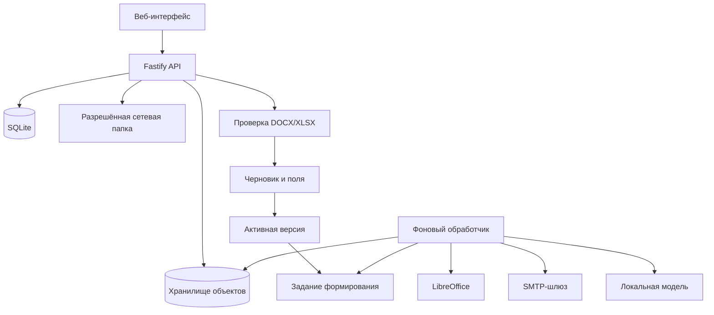

# 🧩 Docomator

**Автономная платформа формирования DOCX/XLSX по шаблонам, данным людей и организаций — без обязательного доступа в Интернет.**

**Текущее состояние:** работает ручной контур от загрузки шаблона до сводного документа либо комплекта персональных документов, включая проверку данных, исправление пропусков, повтор ошибок, скачивание, сетевую и SMTP-доставку.

**Среда:** Node.js 24 LTS, TypeScript, SQLite, LibreOffice, `llama.cpp`, Debian/Astra Linux, центральный процессор, автономная установка.

> [!IMPORTANT]
> Docomator уже выполняет рабочее ручное формирование и доставку документов, но ещё не является завершённым промышленным выпуском. Не завершены сохранённые получатели пространства, расписания, серверное применение ролей, произвольные повторяющиеся области внутри пользовательского шаблона и пилотная приёмка на эталонной Astra/Debian.

## 🎯 Что уже можно сделать

Пользователь без программирования может:

1. создать изолированное пространство подразделения, проекта или заказчика;
2. добавить людей, организации и произвольные свойства;
3. выбрать всех участников, сохранённую группу или отмеченных вручную;
4. загрузить и проверить DOCX/XLSX;
5. сохранить безопасный неизменяемый исходник по SHA-256;
6. отметить абзацы DOCX или ячейки XLSX как типизированные поля;
7. проверить несколько полей одной окончательной копией;
8. создать PDF-предпросмотр и явно активировать версию;
9. сформировать один сводный документ либо отдельный документ для каждого участника;
10. увидеть пропущенные обязательные значения до запуска;
11. заполнить недостающие данные на том же экране;
12. получить отдельный файл, список файлов или ZIP-комплект;
13. повторить только неуспешные документы;
14. передать результат в разрешённую сетевую папку;
15. отправить документ или ZIP-комплект разрешённому получателю через SMTP.

Локальная модель не изменяет файлы и базу данных напрямую. ИИ будет предлагать поля, сопоставления и текстовые блоки, а проверяемые изменения выполняет серверный код.

## 🧭 Готовность подсистем

| Подсистема | Состояние | Фактический результат |
|---|---:|---|
| Основа проекта | ✅ | монорепозиторий, строгий TypeScript, API и фоновый обработчик |
| Хранение | ✅ | SQLite, неизменяемые объекты, очередь, события и аудит |
| Резервирование | ✅ | проверяемое создание и восстановление резервной копии |
| Пространства и аудитории | ✅ | изоляция, группы, выбранные участники, неизменяемые снимки |
| Безопасный приём | ✅ | ограничения OOXML, карантин, запрет макросов и опасных связей |
| Структура и поля | ✅ | абзацы DOCX, ячейки XLSX, устойчивые координаты, типы |
| Многополевая версия | ✅ | компиляция, заполнение, обратное чтение и история |
| PDF и активация | ✅ | LibreOffice, проверенный PDF, подтверждение, каталог |
| Индивидуальный выпуск | ✅ | отдельный DOCX/XLSX на каждого участника, ZIP-комплект |
| Сводный выпуск | ✅ базовый | один стандартизированный DOCX/XLSX с таблицей участников |
| Проверка данных | ✅ | матрица пропусков до запуска и частичный индивидуальный выпуск |
| Исправление данных | ✅ | типизированный ввод пропусков прямо перед формированием |
| Повтор ошибок | ✅ | новое задание только для проблемных участников |
| Сетевая папка | ✅ | безопасная атомарная доставка и журнал операций |
| SMTP | ✅ | фоновая отправка с TLS, ограничением доменов и повторами 4xx |
| Сохранённые получатели | ⬜ | следующий продуктовый этап |
| Расписания и события | ⬜ | очередь готова, планировщик не реализован |
| Серверные роли | 🟡 | роли описаны, применение к маршрутам не завершено |
| Локальные агенты ИИ | ⬜ | подключаются после стабилизации детерминированного пути |

## 🔀 Два режима формирования

### Отдельный документ на каждого

```text
активный шаблон
+ зафиксированный состав N участников
+ значения каждого участника
        ↓
N независимых DOCX/XLSX
        ↓
отдельное скачивание или ZIP-комплект
```

Особенности:

- оформление активного шаблона сохраняется;
- каждый участник обрабатывается независимо;
- отсутствие данных у одного участника не блокирует остальных;
- проблемные строки можно повторить отдельным заданием;
- исходный результат и история не перезаписываются.

### Один сводный документ

```text
активный шаблон и его поля
+ зафиксированный состав N участников
        ↓
один DOCX/XLSX
        ↓
строка на участника, столбцы по полям
```

Базовый сводный режим создаёт стандартизированную таблицу. Произвольная повторяемая строка внутри пользовательского макета DOCX/XLSX остаётся отдельным последующим расширением.

## 🔎 Подготовка выпуска

До создания задания система:

- фиксирует неизменяемый снимок состава;
- перечитывает актуальные свойства участников;
- сопоставляет ключи полей с универсальными свойствами;
- показывает готовых участников и пропущенные обязательные значения;
- блокирует сводный выпуск при неполных обязательных данных;
- разрешает частичный индивидуальный выпуск;
- позволяет заполнить пропуски без перехода в другой раздел.

Поддерживаются строка, длинный текст, число, целое число, логическое значение, дата и дата-время.

## 📄 Формирование и результаты

Задание `document.generate` сохраняется в SQLite и обрабатывается фоновым процессом. Для каждого результата хранятся пространство, активная версия шаблона, снимок аудитории, режим, состояние, SHA-256 файла, ошибка, автор и идентификатор операции.

```text
ожидает → выполняется → готово
                    ↘ готово частично
                    ↘ ошибка
```

## 📁 Доставка в сетевую папку

Администратор задаёт разрешённый корень:

```ini
DOCOMATOR_NETWORK_DELIVERY_ROOT=/mnt/company-share/docomator
```

Пользователь указывает только вложенный каталог. Система запрещает абсолютные пути, `..`, выход за разрешённый корень и символические ссылки, а запись выполняет атомарно.

## ✉️ SMTP-доставка

SMTP выключен до явной настройки. Минимальный пример:

```ini
DOCOMATOR_SMTP_ENABLED=true
DOCOMATOR_SMTP_HOST=smtp.example.org
DOCOMATOR_SMTP_PORT=587
DOCOMATOR_SMTP_STARTTLS=true
DOCOMATOR_SMTP_FROM=docomator@example.org
DOCOMATOR_SMTP_ALLOWED_DOMAINS=example.org,*.internal.example.org
```

Поддерживаются:

- обязательный STARTTLS либо неявный TLS;
- проверка сертификата;
- AUTH PLAIN и AUTH LOGIN только по зашифрованному соединению;
- DOCX, XLSX или ZIP во вложении;
- ограничение размера вложения;
- точные и wildcard-домены получателей;
- стабильный `Message-ID`;
- автоматический повтор временных ответов SMTP 4xx;
- окончательная ошибка для постоянных ответов 5xx;
- идемпотентность одинаковой отправки;
- сохраняемый журнал и фоновые состояния.

Пароль, имя пользователя и адрес SMTP-сервера не передаются браузеру и не сохраняются в SQLite.

## 🛡️ Безопасность документов

До сохранения DOCX/XLSX проверяются сигнатура и структура ZIP, размеры, число частей, опасные пути, шифрование, символические ссылки, макросы, ActiveX, OLE, подписи, внешние связи и запрещённые XML-объявления.

Браузеру не передаётся исходный XML. Сервер повторно читает сохранённый исходник и сам разрешает координату выбранного элемента.

## 👁️ Проверка и активация шаблона

```text
неизменяемый исходник
→ черновик и поля
→ многополевая техническая копия
→ пробное заполнение и обратное чтение
→ проверенная версия
→ фоновый PDF
→ просмотр пользователем
→ явная активация
→ каталог пространства
```

Активная версия неизменяема. Текущая версия определяется отдельным указателем, поэтому исторические задания воспроизводимы.

## 🏗️ Архитектура



Проект остаётся модульным монолитом. Redis, RabbitMQ, Kafka, Kubernetes и отдельная векторная база не требуются.

## 🚀 Запуск для разработки

```bash
npm ci
npm run check

export DOCOMATOR_DATA_DIR="$PWD/.tmp/data"
npm run migrate
npm run build
npm run start:api
```

Во втором терминале:

```bash
export DOCOMATOR_DATA_DIR="$PWD/.tmp/data"
npm run start:worker
```

Интерфейс: `http://127.0.0.1:8080/`.

## 📦 Автономная поставка

```bash
sudo scripts/offline/collect-os-packages.sh --apt-update

scripts/offline/prepare-bundle.sh \
  --llama-server /opt/build/llama.cpp/llama-server \
  --model /opt/build/models/model.gguf \
  --os-packages-dir offline-bundles/os-packages
```

Установка без Интернета:

```bash
tar -xzf docomator-*.tar.gz
cd docomator-*/
sudo ./install.sh --install-os-packages
```

Проверка первого запуска:

```bash
sudo /opt/docomator/current/first-run.sh \
  --config /etc/docomator/docomator.env \
  --check
```

## 🧱 Ближайшие продуктовые этапы

1. Сохранённые получатели и группы получателей пространства.
2. Однократные, ежедневные и ежемесячные расписания.
3. Автоматическая доставка результата по выбранному каналу.
4. Серверное применение ролей пространства.
5. Пилот на реальных шаблонах и эталонной Astra/Debian.
6. Произвольная повторяемая область пользовательского DOCX/XLSX.
7. Локальные агенты ИИ — только после стабилизации предыдущих этапов.

Подробности: [архитектура](docs/ARCHITECTURE.md), [требования](docs/REQUIREMENTS.md), [план](docs/ROADMAP.md), [ближайшие приращения](docs/NEXT_ITERATIONS.md) и [автономное развёртывание](docs/OFFLINE_DEPLOYMENT.md).
