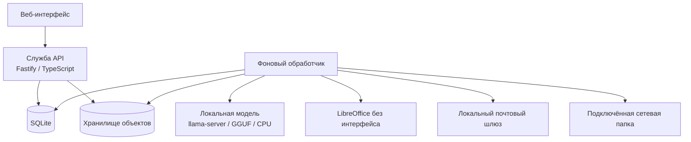

# 🧩 Docomator

**Автономная платформа для подключения, заполнения, автоматического формирования и доставки документов DOCX/XLSX с локальной поддержкой ИИ.**

**Текущее состояние:** пространства и аудитории готовы; следующий крупный этап — безопасный приём DOCX/XLSX и построение структурного представления документа.  
**Среда:** Node.js 24 LTS, TypeScript, SQLite, `llama.cpp`, Debian/Astra Linux, работа без доступа в Интернет.

> [!IMPORTANT]
> Docomator пока не является завершённой системой формирования документов. Уже работают данные, пространства, группы, снимки состава, очередь, журнал действий, резервное копирование и автономная поставка. Приём шаблонов и физическое заполнение DOCX/XLSX находятся в следующих этапах и в интерфейсе честно показаны как запланированные.

## 🎯 Назначение

Docomator должен позволять пользователю без навыков программирования:

- загрузить поддерживаемый DOCX или XLSX;
- найти изменяемые области с помощью локальной модели либо отметить их вручную;
- связать поля документа с произвольными сведениями о людях, организациях и других объектах;
- добавлять новые параметры: рост, вес, количество животных, реквизиты, должность и любые другие типизированные свойства;
- разделять людей и данные по изолированным пространствам;
- выбирать всех участников, сохранённую группу или отмеченных вручную людей;
- сформировать **один общий документ с таблицей/списком** либо **отдельный документ для каждого участника**;
- создавать документы вручную, по событию или расписанию;
- проверять результат, сохранять его во внутренний архив и доставлять по разрешённым каналам;
- работать полностью автономно на центральном процессоре.

> [!NOTE]
> Локальная модель распознаёт запрос, предлагает поля и форматирование, извлекает значения и создаёт разрешённые текстовые блоки. Файлы, база данных, расписания, вычисления и доставка изменяются только проверенным серверным кодом.

## 🧭 Состояние разработки

| Подсистема | Состояние | Реализовано |
|---|---:|---|
| Основа проекта | ✅ | рабочие области npm, строгий TypeScript, API, фоновый обработчик |
| Хранение | ✅ | транзакции SQLite, типизированные значения, хранилище объектов, очередь, журнал событий |
| Резервирование | ✅ | проверяемое резервное копирование, восстановление и откат |
| Пространства | ✅ | изоляция, участники, роли доступа и принадлежность данных |
| Группы и аудитории | ✅ | группы, разовый выбор, неизменяемые снимки, расчёт количества документов |
| Веб-интерфейс | 🟡 | автономная оболочка, база знаний, пространства, помощь и понятные состояния |
| Автономная поставка | 🟡 | комплект поставки, SHA-256, установка, обновление, откат и помощник первого запуска |
| Безопасный приём DOCX/XLSX | ⬜ | следующий этап |
| Компилятор шаблонов | ⬜ | запланирован |
| Формирование DOCX/XLSX | ⬜ | запланировано |
| Расписания и события | 🟡 | очередь и журнал событий готовы; планировщик ещё не реализован |
| Электронная почта и сетевая папка | ⬜ | требования зафиксированы |

Подробности: [план развития](docs/ROADMAP.md), [план реализации](docs/IMPLEMENTATION_PLAN.md) и [требования](docs/REQUIREMENTS.md).

## 👥 Пространства, группы и аудитории

В разделе **«Пространства»** уже можно:

- 🧑‍🤝‍🧑 создать отдельный контур подразделения, филиала, проекта или заказчика;
- 👥 добавить участников только в выбранное пространство;
- ☑️ отметить произвольных людей;
- 🗃️ сохранить выбранных как именованную группу;
- 📸 зафиксировать неизменяемый снимок состава;
- 📄 выбрать «по документу на каждого»;
- 📋 выбрать «один общий документ» с таблицей или списком всех участников.

```text
все активные / сохранённая группа / отмеченные люди
                         ↓
              неизменяемый снимок состава
                 ↙                     ↘
несколько документов              один общий документ
по одному на человека             таблица или список
```

> [!NOTE]
> Выбор аудитории и точное число будущих документов уже реализованы. Подстановка списка участников в повторяющиеся строки DOCX/XLSX будет добавлена в компиляторе шаблонов.

Технический контракт: [пространства и аудитории](docs/SPACES_AND_AUDIENCES.md).

## ✨ Интерфейс без догадок

После запуска откройте:

```text
http://127.0.0.1:8080/
```

Основной принцип: **пользователь всегда понимает, что происходит, почему требуется ожидание и что делать дальше**.

- 🏠 обзор готовности и рекомендуемый следующий шаг;
- 🗂️ рабочая база знаний для типов и свойств;
- 🧑‍🤝‍🧑 отдельный раздел пространств, участников и групп;
- ⏳ конкретное название этапа вместо безымянного индикатора ожидания;
- ✅ подтверждение только после ответа сервера;
- ⚠️ исправимая ошибка с сохранённой формой и идентификатором операции;
- 💡 серые контекстные пояснения и ответы на частые вопросы;
- 📱 боковая навигация на компьютере и нижняя навигация на телефоне;
- 🌗 светлая, тёмная и системная темы;
- ♿ управление клавиатурой, видимый фокус и уменьшение анимации;
- 🔒 отсутствие внешних шрифтов, аналитики и сетевых зависимостей интерфейса.

> [!IMPORTANT]
> Пользовательские сообщения пишутся по-русски. Внутренние машинные ключи (`aggregate`, `one_per_member`, `audience.members`) показываются только там, где они необходимы для настройки или диагностики, и всегда сопровождаются понятным русским объяснением.

Подробный контракт: [ТЗ на интерфейс](docs/UX_UI_SPECIFICATION.md).

## 🏗️ Архитектура



Проект остаётся **модульным монолитом**. В рабочем контуре запускаются:

```text
docomator-api
docomator-worker
docomator-llm
```

Redis, RabbitMQ, Kafka, Kubernetes и отдельная векторная база не являются обязательными.

Подробнее: [архитектура](docs/ARCHITECTURE.md) и [решения ADR](docs/adr/).

## 🚀 Запуск для разработки

Требуются Node.js из [`.node-version`](.node-version) и npm 11+.

```bash
npm ci
npm run check

export DOCOMATOR_DATA_DIR="$PWD/.tmp/data"
npm run migrate
npm run build
npm run start:api
```

Во втором терминале:

```bash
export DOCOMATOR_DATA_DIR="$PWD/.tmp/data"
npm run start:worker
```

Проверка:

```bash
curl http://127.0.0.1:8080/healthz
curl http://127.0.0.1:8080/readyz
curl http://127.0.0.1:8080/api/v1/system/info
curl http://127.0.0.1:8080/api/v1/spaces
```

> [!TIP]
> `npm run check` выполняет сборку, тесты, проверку ссылок, оболочечных сценариев, интерфейса и русской терминологии пользовательских сообщений.

## 📦 Автономная поставка

### 1. Подготовить комплект на подключённом эталонном сервере

Эталонный сервер должен иметь ту же архитектуру процессора и совместимую `glibc`, что и закрытый контур.

```bash
sudo scripts/offline/collect-os-packages.sh --apt-update

scripts/offline/prepare-bundle.sh \
  --llama-server /opt/build/llama.cpp/llama-server \
  --model /opt/build/models/model.gguf \
  --os-packages-dir offline-bundles/os-packages
```

Результат:

```text
offline-bundles/docomator-<версия>-linux-<архитектура>.tar.gz
```

### 2. Установить без доступа в Интернет

```bash
tar -xzf docomator-*.tar.gz
cd docomator-*/
sudo ./install.sh --install-os-packages
```

После успешной установки помощник покажет адрес интерфейса и порядок первоначальной настройки:

```text
пространство → тип «Человек» → участники → группа или отметки
→ один общий документ или документы на каждого → снимок состава
```

Повторный запуск помощника:

```bash
sudo /opt/docomator/current/first-run.sh \
  --config /etc/docomator/docomator.env \
  --check
```

### 3. Обновить существующую установку

```bash
tar -xzf docomator-NEW_VERSION-*.tar.gz
cd docomator-NEW_VERSION-*/
sudo ./update.sh --install-os-packages
```

Сценарий установки проверяет SHA-256, сохраняет прежнюю базу и настройки, устанавливает новую версию, применяет миграции, атомарно переключает текущую версию, проверяет готовность и выполняет откат при ошибке.

Проверка подготовленного комплекта без сети и без systemd:

```bash
sudo scripts/offline/smoke-test.sh \
  offline-bundles/docomator-<версия>-linux-<архитектура>
```

> [!WARNING]
> `install.sh` и `update.sh` не скачивают данные из сети. Node.js, зависимости npm, `llama-server`, модель GGUF и дополнительные пакеты `.deb` должны находиться внутри подготовленного комплекта.

Полная инструкция: [автономное развёртывание](docs/OFFLINE_DEPLOYMENT.md).

## 🛟 Резервное копирование и восстановление

```bash
sudo /opt/docomator/current/backup.sh
sudo /opt/docomator/current/restore.sh --backup /path/to/backup
```

Резервная копия содержит согласованный снимок SQLite, неизменяемые файлы, настройки и перечень SHA-256. Перед восстановлением создаётся дополнительная копия текущего состояния; при ошибке система возвращается к прежней версии.

Подробности: [резервное копирование и восстановление](docs/BACKUP_RESTORE.md).

## 🤖 Агенты Codex

В проекте определены специализированные агенты:

| Агент | Назначение |
|---|---|
| `architecture_guardian` | архитектурные границы, решения и зависимости |
| `backend_worker` | API, прикладная логика и SQLite |
| `document_engineer` | DOCX/XLSX, структурное представление и формирование |
| `automation_engineer` | расписания, события, идемпотентность и доставка |
| `offline_release_engineer` | автономный комплект, установка и обновление |
| `security_reviewer` | проверка угроз и отрицательные сценарии |
| `test_engineer` | стратегия испытаний и эталонные файлы |
| `docs_maintainer` | требования, план развития и документация |
| `product_designer` | информационная архитектура, тексты, состояния и доступность |
| `frontend_engineer` | автономный интерфейс, адаптивность, формы и проверки |

Основные файлы:

```text
AGENTS.md
.codex/config.toml
.codex/agents/*.toml
```

## 🗂️ Структура репозитория

```text
apps/api/               служба API
apps/api/ui/            автономный адаптивный веб-интерфейс
apps/worker/            фоновые задания и будущий планировщик
packages/config/        типизированные настройки
packages/contracts/     общие контракты
packages/storage/       SQLite, очередь, журнал событий и хранилище объектов
migrations/             неизменяемые миграции SQLite
scripts/runtime/        миграции, резервирование и восстановление
scripts/offline/        подготовка, установка, обновление и помощник первого запуска
deploy/systemd/         защищённые шаблоны служб systemd
config/                 примеры настроек и список пакетов ОС
docs/                   требования, архитектура, план и развитие
.codex/agents/          специализированные агенты Codex
```

## 📚 Документы проекта

- [Основное техническое задание](docs/TECHNICAL_SPECIFICATION.md)
- [ТЗ на интерфейс](docs/UX_UI_SPECIFICATION.md)
- [Требования](docs/REQUIREMENTS.md)
- [Пространства и аудитории](docs/SPACES_AND_AUDIENCES.md)
- [Архитектура](docs/ARCHITECTURE.md)
- [План реализации](docs/IMPLEMENTATION_PLAN.md)
- [План развития](docs/ROADMAP.md)
- [Ядро хранения](docs/PERSISTENCE_KERNEL.md)
- [API базы знаний](docs/KNOWLEDGE_REGISTRY_API.md)
- [Резервное копирование и восстановление](docs/BACKUP_RESTORE.md)
- [Автономное развёртывание](docs/OFFLINE_DEPLOYMENT.md)
- [Эксплуатационные правила](docs/OPERATIONS.md)
- [Участие в разработке](CONTRIBUTING.md)
- [Политика безопасности](SECURITY.md)

## 🧪 Полезные команды

```bash
npm run clean          # удалить результаты сборки
npm run build          # собрать все рабочие области
npm test               # запустить тесты
npm run check          # выполнить полную проверку
npm run migrate        # применить миграции SQLite
npm run backup -- ...  # создать проверяемую резервную копию
npm run restore -- ... # проверить или восстановить резервную копию
npm run bundle:offline # подготовить автономный комплект
npm run bundle:smoke -- /path/to/extracted-bundle # проверить установку и обновление
```
