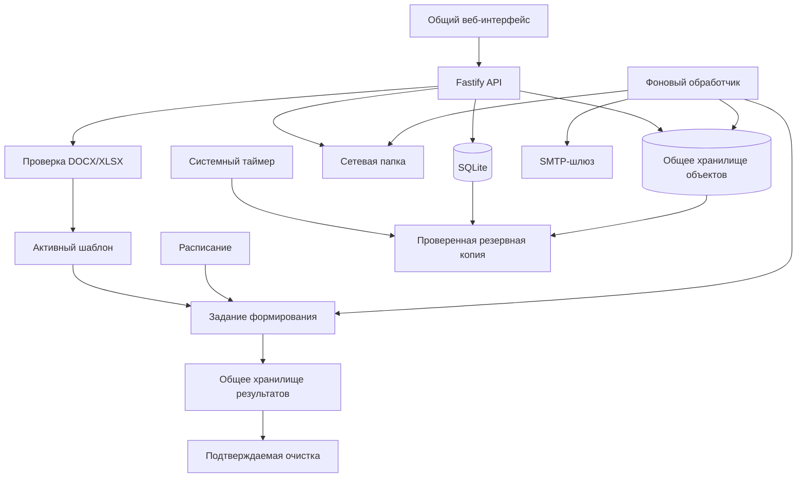

# 🧩 Docomator

**Автономный корпоративный сервис формирования DOCX/XLSX по шаблонам и общим данным — без обязательного доступа в Интернет и без авторизации.**

**Текущее состояние:** работает полный базовый контур от массовой загрузки данных и безопасной подготовки шаблона до ручного или календарного выпуска, общего хранилища результатов, доставки, диагностики и автоматического резервирования.

**Среда:** Node.js 24 LTS, TypeScript, SQLite, LibreOffice, `llama.cpp`, Debian/Astra Linux, центральный процессор, автономная установка.

> [!IMPORTANT]
> Docomator рассчитан на доверенный внутренний контур. Все пользователи видят общие данные, шаблоны, расписания и готовые документы. Разделы используются для организации участников и процессов, а не для разграничения доступа.

## 🎯 Что уже работает

Пользователь без программирования может:

1. импортировать до 1000 участников из CSV или XLSX;
2. повторно загружать обновлённый список без создания дублей;
3. создавать произвольные типизированные свойства и группы;
4. безопасно загрузить DOCX/XLSX;
5. отметить абзацы DOCX или ячейки XLSX как поля;
6. проверить несколько полей одной окончательной копией;
7. создать PDF-предпросмотр и активировать версию;
8. сформировать один сводный документ;
9. сформировать отдельный документ для каждого участника;
10. увидеть и исправить обязательные пропуски до запуска;
11. получить отдельный файл или ZIP-комплект;
12. повторить только неуспешные документы;
13. передать результат в разрешённую сетевую папку;
14. отправить результат через SMTP;
15. создать однократное, ежедневное или ежемесячное расписание;
16. автоматически доставить календарный выпуск через SMTP или сетевую папку;
17. увидеть новый результат в общем корпоративном хранилище;
18. рассчитать и подтвердить безопасную очистку объектов без ссылок;
19. проверить готовность всех обязательных компонентов на одном экране;
20. использовать ежедневные проверяемые резервные копии.

## 📥 Массовый импорт данных

В разделе участников доступен мастер импорта CSV/XLSX:

```text
файл
→ предварительный просмотр
→ выбор устойчивого ключа и ФИО
→ сопоставление колонок со свойствами
→ создание или обновление участников
→ необязательная сохранённая группа
→ отчёт и история
```

Поддерживаются CSV UTF-8 с разделителем `;`, `,` или табуляцией и первый рабочий лист XLSX. Один запуск ограничен 1000 строками и 100 колонками.

Устойчивый внешний ключ используется повторно: новые строки создают участников, существующие обновляются, а неизменившиеся значения не получают лишнюю версию. Ошибочная строка не блокирует корректные строки.

## 📄 Общее хранилище документов

Все успешно или частично сформированные результаты — ручные и автоматические — попадают в единый раздел **«Документы»**.

```text
Новый → Просмотрен → Забран
                    ↘ Удалён
```

Правила:

- новый результат подсвечивается и увеличивает общий счётчик;
- автоматические документы отмечаются названием расписания и календарным периодом;
- браузер проверяет появление результатов каждые 15 секунд;
- скачивание переводит результат в состояние «Забран»;
- забранный результат остаётся в истории;
- документ удаляется только отдельным явным действием;
- удалённый результат становится недоступен и через старые ссылки задания.

При обновлении существующей установки прежние результаты переносятся как уже просмотренные, поэтому после миграции не возникает ложная очередь уведомлений.

## 🔀 Два режима формирования

### Документ на каждого

```text
активный шаблон
+ зафиксированная аудитория N участников
→ N независимых DOCX/XLSX
→ отдельные файлы или ZIP
```

Ошибка одного участника не блокирует остальные документы. После исправления данных можно повторить только проблемные строки.

### Один сводный документ

```text
активный шаблон и его поля
+ аудитория N участников
→ один DOCX/XLSX
→ строка на участника
```

Базовый режим создаёт стандартизированную таблицу. Повторяемая строка внутри произвольного пользовательского макета остаётся следующим расширением компилятора.

## 🔎 Проверка данных перед выпуском

До постановки задания система:

- фиксирует неизменяемый снимок состава;
- получает актуальные свойства каждого участника;
- показывает готовые и отсутствующие обязательные значения;
- позволяет заполнить пропуски на том же экране;
- блокирует неполный сводный выпуск;
- разрешает частичный индивидуальный выпуск.

Поддерживаются строка, длинный текст, число, целое число, логическое значение, дата и дата-время.

## ⏱️ Расписания

Поддерживаются:

- однократный, ежедневный и ежемесячный запуск с 1-го по 28-е число;
- часовой пояс IANA;
- сохранённая группа и активная версия шаблона;
- оба режима формирования;
- автоматическая предварительная проверка;
- ручной запуск без сдвига календаря;
- защита от второго запуска одного периода;
- восстановление после перезапуска worker;
- отсутствие доставки, SMTP или разрешённая сетевая папка.

```text
расписание
→ снимок группы
→ проверка данных
→ формирование
→ общее хранилище
→ необязательная доставка
```

Сетевой путь расписания поддерживает `{schedule}`, `{period}`, `{template}`, `{group}`. Даже при ошибке доставки готовый документ остаётся в общем хранилище.

## 📁 Доставка в сетевую папку

Администратор задаёт разрешённый корень:

```ini
DOCOMATOR_NETWORK_DELIVERY_ROOT=/mnt/company-share/docomator
```

Пользователь задаёт только вложенный каталог. Система запрещает абсолютные пути, `..`, выход за корень и символические ссылки. Запись выполняется атомарно через временный файл и переименование.

## ✉️ SMTP-доставка

Канал выключен до явной настройки:

```ini
DOCOMATOR_SMTP_ENABLED=true
DOCOMATOR_SMTP_HOST=smtp.example.org
DOCOMATOR_SMTP_PORT=587
DOCOMATOR_SMTP_STARTTLS=true
DOCOMATOR_SMTP_FROM=docomator@example.org
DOCOMATOR_SMTP_ALLOWED_DOMAINS=example.org,*.internal.example.org
```

Поддерживаются STARTTLS или неявный TLS, проверка сертификата, AUTH PLAIN/LOGIN только по зашифрованному соединению, повтор временных 4xx-ошибок и стабильный `Message-ID`.

## 🧰 Готовность системы

На главной странице расположен операторский отчёт, который проверяет фактическую среду:

- целостность SQLite и внешние ключи;
- heartbeat фонового worker;
- контрольную запись в хранилище объектов;
- свободное место файловой системы;
- запуск LibreOffice;
- сетевую папку;
- полноту SMTP-конфигурации;
- последнюю резервную копию;
- доступность общего реестра результатов.

Итог имеет состояние **«готово»**, **«требуется внимание»** или **«пилот заблокирован»**. Для каждой проблемы показывается конкретное действие администратора.

## 💾 Автоматические резервные копии

Автономная установка включает ежедневный systemd-таймер:

```ini
DOCOMATOR_BACKUP_ENABLED=true
DOCOMATOR_BACKUP_RETENTION=7
```

Копии создаются около 03:15 по локальному времени с небольшой случайной задержкой и хранятся в `<DOCOMATOR_DATA_DIR>/backups`. Пропущенный запуск выполняется после включения машины.

Каждая копия содержит согласованный снимок SQLite, объектное хранилище и локальную конфигурацию. После создания проверяются SQLite, внешние ключи, manifest и SHA-256 всех файлов. Старые обычные копии удаляются по лимиту хранения.

Команды администратора:

```bash
systemctl list-timers docomator-backup.timer
sudo systemctl start docomator-backup.service
sudo journalctl -u docomator-backup.service
```

Ручной сценарий `backup.sh` использует ту же блокировку, поэтому ручная и автоматическая копия не выполняются одновременно.

## 🧹 Обслуживание диска

В разделе «Документы» доступен двухшаговый процесс очистки:

1. выбирается минимальный возраст объекта;
2. сервер динамически проверяет все ссылки SQLite;
3. формируется пакет до 200 объектов и контрольный токен;
4. пользователь отдельно подтверждает необратимое удаление;
5. после выполнения показываются освобождённый объём, ошибки и остаток.

Файлы с действующими ссылками не входят в план. Если состав данных изменился между расчётом и подтверждением, сервер отменяет операцию и требует новый план.

## 🛡️ Безопасность документов

До сохранения DOCX/XLSX проверяются сигнатура и структура ZIP, размеры и сжатие, опасные пути, шифрование, символические ссылки, макросы, ActiveX, OLE, подписи, внешние связи и опасные XML-объявления.

Браузер не получает исходный XML. Сервер повторно читает сохранённый исходник и сам разрешает координаты выбранных элементов.

## 🏗️ Архитектура



Проект остаётся модульным монолитом. Redis, RabbitMQ, Kafka, Kubernetes и отдельная векторная база не требуются.

## 🚀 Запуск для разработки

```bash
npm ci
npm run check

export DOCOMATOR_DATA_DIR="$PWD/.tmp/data"
npm run migrate
npm run build
npm run start:api
```

Во втором терминале:

```bash
export DOCOMATOR_DATA_DIR="$PWD/.tmp/data"
npm run start:worker
```

Интерфейс: `http://127.0.0.1:8080/`.

## 📦 Автономная поставка

```bash
sudo scripts/offline/collect-os-packages.sh --apt-update

scripts/offline/prepare-bundle.sh \
  --llama-server /opt/build/llama.cpp/llama-server \
  --model /opt/build/models/model.gguf \
  --os-packages-dir offline-bundles/os-packages
```

Установка:

```bash
tar -xzf docomator-*.tar.gz
cd docomator-*/
sudo ./install.sh --install-os-packages
```

Проверка:

```bash
sudo /opt/docomator/current/first-run.sh \
  --config /etc/docomator/docomator.env \
  --check
```

## 🧱 Ближайшие продуктовые этапы

1. Пилот на реальных шаблонах и чистой Astra/Debian.
2. Выпуски на 1, 10, 100 и 1000 участников.
3. Пробное восстановление резервной копии на отдельном стенде.
4. Поиск физических объектов, отсутствующих в SQLite.
5. Повторяемая область внутри пользовательского DOCX/XLSX.
6. Предметные события.
7. Локальные агенты ИИ — после стабилизации детерминированного пути.

Подробности: [архитектура](docs/ARCHITECTURE.md), [требования](docs/REQUIREMENTS.md), [план](docs/ROADMAP.md), [ближайшие приращения](docs/NEXT_ITERATIONS.md) и [автономное развёртывание](docs/OFFLINE_DEPLOYMENT.md).
