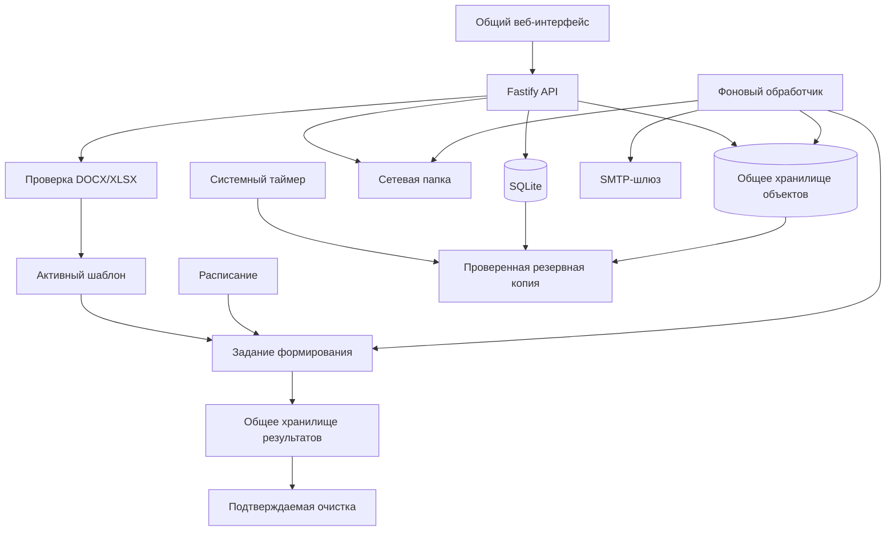

# 🧩 Docomator

**Автономный корпоративный сервис формирования DOCX/XLSX по шаблонам и общим данным — без обязательного доступа в Интернет и без авторизации.**

**Текущее состояние:** работает базовый технический контур от массовой загрузки данных и безопасной подготовки шаблона до ручного или календарного выпуска, общего хранилища результатов, доставки, диагностики и автоматического резервирования. Путь «сотрудники → шаблон → личные карточки» реализован и покрыт локальными браузерными сценариями; новые и повторно скомпилированные XLSX получают проверяемый служебный лист `_AI_META`. Пользовательская приёмка без инструкции ещё не завершена; статус фиксируется в [плане UX-R1](docs/UX_SIMPLIFICATION_PLAN.md).

**Целевая среда (совместимость ещё подтверждается):** Node.js 24 LTS, TypeScript, SQLite, LibreOffice, `llama.cpp`, Debian/Astra Linux, центральный процессор, автономная установка. Проверенные сочетания публикуются только в [матрице совместимости](docs/SUPPORT_MATRIX.md).

> [!IMPORTANT]
> Docomator рассчитан на доверенный внутренний контур. Все пользователи видят общие данные, шаблоны, расписания и готовые документы. Разделы используются для организации участников и процессов, а не для разграничения доступа.

Для первого безопасного прогона используйте [вымышленные данные, DOCX/XLSX-шаблоны, малые проверочные файлы и заполненные варианты](examples/README.md). Положительные файлы проходят рабочую компиляцию и обратное чтение, отдельный инертный файл подтверждает отказ проверки, а весь точный состав входит в offline bundle. Набор не заменяет реальные Office-документы и целевую [матрицу Debian/Astra/LibreOffice](docs/SUPPORT_MATRIX.md).

[Предварительные примечания к первому release candidate](docs/RELEASE_NOTES.md) фиксируют реализованный объём, миграции, откат и незакрытые свидетельства. Они и соседняя матрица совместимости входят в offline bundle с контрольными суммами, но не меняют текущую версию `0.1.0-alpha.0` и не объявляют RC до фактической приёмки.

## 🎯 Что уже работает в техническом контуре

Интерфейс и сервер уже поддерживают следующие операции; основной кадровый путь собран по пользовательским задачам, а расширенная настройка остаётся в технических разделах:

1. импортировать до 1000 участников из CSV или XLSX;
2. повторно загружать обновлённый список без создания дублей;
3. создавать произвольные типизированные свойства и группы;
4. безопасно загрузить DOCX/XLSX;
5. выделить изменяемый текст внутри абзацев DOCX или выбрать ячейки XLSX как поля;
6. задать безопасный русский формат числа, даты, даты-времени или `Да`/`Нет` и проверить несколько полей одной окончательной копией;
7. создать PDF-предпросмотр и активировать версию;
8. сформировать один сводный документ;
9. сформировать отдельный документ для каждого участника;
10. увидеть и исправить обязательные пропуски до запуска;
11. получить отдельный файл или ZIP-комплект;
12. повторить только неуспешные документы;
13. сохранить получателей электронной почты;
14. передать результат в разрешённую сетевую папку;
15. отправить результат через SMTP;
16. создать однократное, ежедневное или ежемесячное расписание;
17. автоматически доставить календарный выпуск через SMTP или сетевую папку;
18. увидеть новый результат в общем корпоративном хранилище;
19. после перехода или перезагрузки увидеть ход предпросмотра, формирования и доставки в едином центре операций;
20. рассчитать и подтвердить безопасную очистку объектов без ссылок;
21. проверить готовность всех обязательных компонентов на одном экране;
22. использовать ежедневные проверяемые резервные копии.

## 📥 Массовый импорт данных

В разделе участников доступен мастер импорта CSV/XLSX:

```text
файл
→ предварительный просмотр
→ выбор колонки обновления и ФИО
→ сопоставление колонок со свойствами
→ создание или обновление участников
→ необязательная сохранённая группа
→ отчёт и история
```

Поддерживаются CSV UTF-8 с разделителем `;`, `,` или табуляцией и первый рабочий лист XLSX. Один запуск ограничен 1000 строками и 100 колонками.

Колонка обновления используется для повторного сопоставления: новые строки создают участников, существующие обновляются, а неизменившиеся значения не получают лишнюю версию. Машинные ключи система назначает сама и не требует вводить их в обычном сценарии. Ошибочная строка не блокирует корректные строки.

## 📥 Результаты и операции

Все сохраняемые операции выбранного раздела и успешно или частично сформированные ручные и автоматические результаты собраны в едином разделе **«Результаты»**. Запущенная работа продолжается на локальном сервере и остаётся видимой после перезагрузки страницы.

```text
Новый → Просмотрен → Забран
                    ↘ Удалён
```

Правила:

- новый результат подсвечивается и увеличивает общий счётчик;
- автоматические документы отмечаются названием расписания и календарным периодом;
- браузер проверяет появление результатов каждые 15 секунд;
- центр показывает ожидание, выполнение, автоматический повтор, частичный результат, успех и ошибку предпросмотра, формирования или доставки;
- после успешного или частично успешного ручного выпуска интерфейс сам открывает созданную карточку в «Результатах»;
- скачивание из мастера, истории или общего списка переводит один и тот же результат в состояние «Забран» и журналируется;
- забранный результат остаётся в истории;
- документ удаляется только отдельным явным действием;
- удалённый результат становится недоступен и через старые ссылки задания.

При обновлении существующей установки прежние результаты переносятся как уже просмотренные, поэтому после миграции не возникает ложная очередь уведомлений.

## 🔀 Два режима формирования

### Документ на каждого

```text
активный шаблон
+ зафиксированная аудитория N участников
→ N независимых DOCX/XLSX
→ отдельные файлы или ZIP
```

Ошибка одного участника не блокирует остальные документы. После исправления данных можно повторить только проблемные строки.

### Один сводный документ

```text
активный шаблон и его поля
+ аудитория N участников
→ один DOCX/XLSX
→ строка на участника
```

Если активный шаблон содержит проверенную повторяемую область, backend заполняет одну строку DOCX либо строку/непрерывный диапазон XLSX на каждого участника. Для прежних шаблонов без такого контракта создаётся стандартизированная таблица.

## 🔎 Проверка данных перед выпуском

До постановки задания система:

- фиксирует неизменяемый снимок состава;
- получает актуальные свойства каждого участника;
- показывает готовые и отсутствующие обязательные значения;
- позволяет заполнить пропуски на том же экране;
- блокирует неполный сводный выпуск;
- разрешает частичный индивидуальный выпуск.

Поддерживаются строка, длинный текст, число, целое число, логическое значение, дата и дата-время. Новые числовые и календарные поля используют неизменяемый декларативный формат без пользовательского кода: десятичная запятая, `ДД.ММ.ГГГГ`, явный часовой пояс для даты-времени и `Да`/`Нет`.

## ⏱️ Расписания

Поддерживаются:

- однократный, ежедневный и ежемесячный запуск с 1-го по 28-е число;
- часовой пояс IANA;
- сохранённая группа и активная версия шаблона;
- оба режима формирования;
- автоматическая предварительная проверка;
- ручной запуск без сдвига календаря;
- защита от второго запуска одного периода;
- восстановление после перезапуска worker;
- отсутствие доставки, SMTP или разрешённая сетевая папка.

```text
расписание
→ снимок группы
→ проверка данных
→ формирование
→ общее хранилище
→ необязательная доставка
```

Сетевой путь расписания поддерживает `{schedule}`, `{period}`, `{template}`, `{group}`. Даже при ошибке доставки готовый документ остаётся в общем хранилище.

## 📁 Доставка в сетевую папку

Администратор задаёт разрешённый корень:

```ini
DOCOMATOR_NETWORK_DELIVERY_ROOT=/mnt/company-share/docomator
```

Пользователь задаёт только вложенный каталог. Система запрещает абсолютные пути, `..`, выход за корень и символические ссылки. Запись выполняется атомарно через временный файл и переименование.

## ✉️ SMTP-доставка

Канал выключен до явной настройки:

```ini
DOCOMATOR_SMTP_ENABLED=true
DOCOMATOR_SMTP_HOST=smtp.example.org
DOCOMATOR_SMTP_PORT=587
DOCOMATOR_SMTP_STARTTLS=true
DOCOMATOR_SMTP_FROM=docomator@example.org
DOCOMATOR_SMTP_ALLOWED_DOMAINS=example.org,*.internal.example.org
```

Поддерживаются STARTTLS или неявный TLS, проверка сертификата, AUTH PLAIN/LOGIN только по зашифрованному соединению, повтор временных 4xx-ошибок и стабильный `Message-ID`.

## 🧰 Готовность системы

На главной странице расположен операторский отчёт, который проверяет фактическую среду:

- целостность SQLite и внешние ключи;
- heartbeat фонового worker;
- контрольную запись в хранилище объектов;
- свободное место файловой системы;
- запуск LibreOffice;
- сетевую папку;
- полноту SMTP-конфигурации;
- последнюю резервную копию;
- доступность общего реестра результатов.

Итог имеет состояние **«готово»**, **«требуется внимание»** или **«пилот заблокирован»**. Для каждой проблемы показывается конкретное действие администратора.

## 💾 Автоматические резервные копии

Автономная установка включает ежедневный systemd-таймер:

```ini
DOCOMATOR_BACKUP_ENABLED=true
DOCOMATOR_BACKUP_RETENTION=7
```

Копии создаются около 03:15 по локальному времени с небольшой случайной задержкой и хранятся в `<DOCOMATOR_DATA_DIR>/backups`. Пропущенный запуск выполняется после включения машины.

Каждая копия содержит согласованный снимок SQLite, объектное хранилище и локальную конфигурацию. После создания проверяются SQLite, внешние ключи, manifest и SHA-256 всех файлов. Старые обычные копии удаляются по лимиту хранения.

Команды администратора:

```bash
systemctl list-timers docomator-backup.timer
sudo systemctl start docomator-backup.service
sudo journalctl -u docomator-backup.service
```

Ручной сценарий `backup.sh` использует ту же блокировку, поэтому ручная и автоматическая копия не выполняются одновременно.

## 🧹 Обслуживание диска

В разделе «Результаты» доступен двухшаговый процесс очистки:

1. выбирается минимальный возраст объекта;
2. сервер динамически проверяет все ссылки SQLite;
3. формируется пакет до 200 объектов и контрольный токен;
4. пользователь отдельно подтверждает необратимое удаление;
5. после выполнения показываются освобождённый объём, ошибки и остаток.

Файлы с действующими ссылками не входят в план. Если состав данных изменился между расчётом и подтверждением, сервер отменяет операцию и требует новый план.

## 🛡️ Безопасность документов

До сохранения DOCX/XLSX проверяются сигнатура и структура ZIP, размеры и сжатие, опасные пути, шифрование, символические ссылки, макросы, ActiveX, OLE, подписи, внешние связи и опасные XML-объявления.

Браузер не получает исходный XML. Сервер повторно читает сохранённый исходник и сам разрешает координаты выбранных элементов. После перезагрузки мастер продолжает с этой серверной копии: повторно выбирать локальный файл не требуется.

В DOCX можно выбрать одну строку таблицы и отметить «Повторять эту строку для сотрудников». В XLSX можно выбрать всю использованную строку либо непрерывный диапазон одной строки. Координаты повторно выводит сервер из сохранённой структуры; формулу нельзя назначить полем. В сводном выпуске backend детерминированно создаёт по строке на участника из неизменяемого снимка, сохраняет разрешённое оформление, безопасно переводит ограниченные локальные формулы XLSX и повторно считывает каждое значение. Для прежних шаблонов без такой привязки остаётся стандартизированная сводная таблица; сложные и несколько независимых областей ещё не поддерживаются.

## 🏗️ Архитектура



Проект остаётся модульным монолитом. Redis, RabbitMQ, Kafka, Kubernetes и отдельная векторная база не требуются.

## 🚀 Локальный запуск и тестирование интерфейса

Для исходного дерева нужны Node.js не ниже `24.18.0` и npm не ниже `11`. Проверьте среду до установки зависимостей:

```bash
node --version
npm --version
npm ci
npm run build
```

`start:api` и `start:worker` запускают собранные файлы из `dist`, поэтому после первого клонирования или изменения TypeScript нужен `npm run build`.

### Ручная проверка с реальным API и SQLite

В первом терминале примените миграции и запустите API:

```bash
DOCOMATOR_DATA_DIR="$PWD/.tmp/data" npm run migrate
DOCOMATOR_DATA_DIR="$PWD/.tmp/data" npm run start:api
```

Во втором терминале запустите фоновый обработчик с тем же каталогом данных:

```bash
DOCOMATOR_DATA_DIR="$PWD/.tmp/data" npm run start:worker
```

В третьем терминале проверьте процесс и готовность схемы, затем откройте `http://127.0.0.1:8080/`:

```bash
curl --fail --silent --show-error http://127.0.0.1:8080/healthz
curl --fail --silent --show-error http://127.0.0.1:8080/readyz
```

Оба запроса должны вернуть HTTP 200, а `/readyz` — состояние `"status":"ok"`. API достаточно для загрузки оболочки и обычных операций с данными; worker выполняет PDF-предпросмотр, формирование, расписания и доставку. Остановите оба процесса сочетанием `Ctrl+C`; данные в `.tmp/data` сохранятся.

PDF-предпросмотр включён по умолчанию и ожидает LibreOffice по пути `/usr/bin/libreoffice`. Если executable расположен иначе, перед запуском API и worker задайте `DOCOMATOR_LIBREOFFICE_BIN`. Без LibreOffice интерфейс и операции с данными доступны, но задания предпросмотра завершатся явной ошибкой. Локальная модель по умолчанию выключена и для детерминированного пути не нужна.

### Если оболочка показывает код 503

Загруженная страница означает, что процесс API уже работает. Код 503 от `/readyz` означает, что сервер не может использовать `DOCOMATOR_DATA_DIR` или база не содержит все текущие миграции. Посмотрите поля `checks.dataDirectory` и `checks.database`:

```bash
curl --include http://127.0.0.1:8080/readyz
```

Если `database` имеет значение `error`, остановите API и worker, примените миграции и снова запустите оба процесса с одним и тем же `DOCOMATOR_DATA_DIR`:

```bash
DOCOMATOR_DATA_DIR="$PWD/.tmp/data" npm run migrate
```

Если `dataDirectory` имеет значение `error`, проверьте путь и права записи. Если `apps/api/dist/server.js` отсутствует, выполните `npm run build`. Дополнительная диагностика описана в [руководстве по эксплуатации](docs/OPERATIONS.md).

### Автоматическая проверка клиентской оболочки

Playwright не запускает сервер автоматически. Оставьте API из ручного сценария работающим; worker для этой проверки не нужен. На подключённом стенде один раз установите Chromium, затем запустите сценарии:

```bash
npx playwright install chromium
DOCOMATOR_E2E_BASE_URL=http://127.0.0.1:8080 npm run test:e2e
```

Эти тесты проверяют клиентскую оболочку, адаптивность и доступность: внутри браузера они подменяют `/readyz` и `/api/v1/**`, поэтому не проверяют реальную SQLite, миграции или worker. Полная инструкция и дополнительные команды находятся в [описании локального E2E-контура](tests/e2e/README.md).

### Полная проверка перед PR

```bash
npm run check
```

Команда уже включает сборку, модульные и интеграционные тесты, core release-gate, LibreOffice gate, проверки shell-скриптов, документации, UI и русского языка. Браузерные E2E запускаются отдельно. Формальная P5-приёмка выполняется только из проверенного offline bundle по [протоколу UX-приёмки](docs/UX_ACCEPTANCE_PROTOCOL.md); локальные Playwright-отчёты помечены `development` и актом P5 не являются.

## 📦 Автономная поставка

> [!IMPORTANT]
> **Debian и Astra Linux собираются как разные target-профили.** Нельзя повторно использовать набор `.deb` или архив между выпусками ОС. Обе команды ниже создают полный пакет: локальная модель, LibreOffice preview, offline Chromium/Playwright/axe и все обязательные target gates. Команду запускают обычным пользователем на подключённой эталонной VM; `sudo` используется только внутренним шагом скачивания `.deb`.

### 🟦 Debian

> [!TIP]
> Debian-профиль использует пакет `chromium` и путь `/usr/bin/chromium`, если они не переопределены явно.

```bash
npm run bundle:offline:debian -- \
  --apt-update \
  --llama-server /srv/build/llama.cpp/llama-server \
  --model /srv/models/model.gguf
```

Артефакты сохраняются отдельно от Astra:

```text
offline-bundles/targets/debian-<VERSION_ID>-<deb-arch>/
├── os-packages/
└── release/
    ├── docomator-<version>-linux-<arch>.tar.gz
    └── docomator-<version>-linux-<arch>.tar.gz.sha256
```

### 🟥 Astra Linux

> [!WARNING]
> На Astra Linux пакет и executable Chromium зависят от редакции, update и подключённых репозиториев. Их нельзя угадывать или наследовать из Debian-профиля: сначала подтвердите фактические значения на той же эталонной VM.

```bash
ASTRA_CHROMIUM_PACKAGE='chromium'
ASTRA_CHROMIUM_BIN='/usr/bin/chromium'

dpkg-query -W -f='${Package}\t${Version}\n' "$ASTRA_CHROMIUM_PACKAGE"
dpkg-query -S "$ASTRA_CHROMIUM_BIN"

npm run bundle:offline:astra -- \
  --apt-update \
  --llama-server /srv/build/llama.cpp/llama-server \
  --model /srv/models/model.gguf \
  --ux-chromium-package "$ASTRA_CHROMIUM_PACKAGE" \
  --ux-chromium-bin "$ASTRA_CHROMIUM_BIN"
```

Если Astra использует другое имя пакета браузера, сборщик заменяет строку `chromium` только во временном effective package list; исходный `config/os-packages.txt` не меняется. Артефакты сохраняются в `offline-bundles/targets/astra-<VERSION_ID>-<deb-arch>/`.

Для уже собранного и проверенного набора `.deb` повторный `sudo`-шаг можно исключить:

```bash
npm run bundle:offline:debian -- \
  --os-packages-dir /srv/docomator-os-packages/debian \
  --llama-server /srv/build/llama.cpp/llama-server \
  --model /srv/models/model.gguf
```

Полный список параметров, варианты с локальным Node.js archive/runtime и требования к reference host приведены в [процедуре автономного развёртывания](docs/OFFLINE_DEPLOYMENT.md).

Архив нельзя распаковывать через `sudo` сразу после переноса. Установка выполняется только по [fail-fast процедуре автономного развёртывания](docs/OFFLINE_DEPLOYMENT.md): сверка закреплённого SHA-256 из подписанного организационного manifest, непривилегированный preflight, копирование тех же байтов в уникальный root-owned staging-каталог и повторная проверка перед `install.sh`.

Проверка:

```bash
sudo "$BUNDLE_ROOT/smoke-test.sh" "$BUNDLE_ROOT"
"$BUNDLE_ROOT/target-release-gate.sh" \
  --config /etc/docomator/docomator.env

install -d -m 0700 "$HOME/docomator-p5"
"$BUNDLE_ROOT/ux-acceptance-gate.sh" \
  --base-url http://127.0.0.1:8080/ \
  --output "$HOME/docomator-p5/automation-01"

sudo /opt/docomator/current/first-run.sh \
  --config /etc/docomator/docomator.env \
  --check
```

UX-gate принимает только точное совпадение профиля ОС/архитектуры, установленного Debian-пакета Chromium и идентичности работающего релиза с проверенным bundle. Значения `commitSha`, `bundleManifestSha256`, `releaseMetadataSha256`, `browserVersion` из `run-metadata.json` переносятся в акт P5.

## 🧱 Ближайшие продуктовые этапы

1. Завершение пользовательской приёмки простого пути личных карточек без машинных ключей.
2. Пилот на реальных шаблонах и чистой Astra/Debian.
3. Выпуски на 1, 10, 100 и 1000 участников и пробное восстановление резервной копии на отдельном стенде.
4. Поиск физических объектов, отсутствующих в SQLite.
5. Повторяемые списки DOCX, несколько строк XLSX и более сложные структурные области.
6. Предметные события.
7. Локальные агенты ИИ — после стабилизации детерминированного пути.

Подробности: [архитектура](docs/ARCHITECTURE.md), [требования](docs/REQUIREMENTS.md), [release-gate](docs/RELEASE_GATE.md), [план](docs/ROADMAP.md), [ближайшие приращения](docs/NEXT_ITERATIONS.md) и [автономное развёртывание](docs/OFFLINE_DEPLOYMENT.md).
