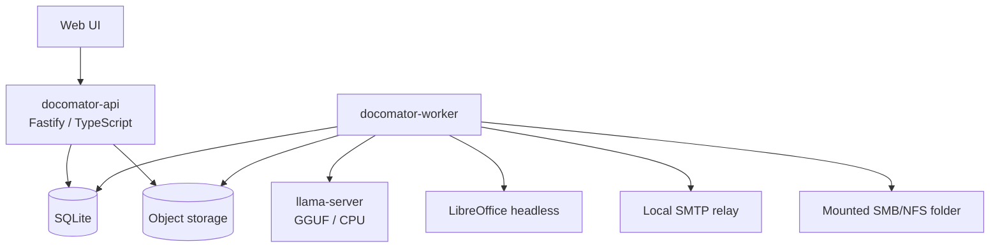

# 🧩 Docomator

**Автономная AI-assisted платформа для подключения, заполнения, автоматического формирования и доставки DOCX/XLSX-документов.**

[](#-текущее-состояние)
[](.node-version)
[](docs/OFFLINE_DEPLOYMENT.md)

> [!IMPORTANT]
> Проект находится на этапе persistence kernel. Уже работают API/worker bootstrap, Knowledge Registry REST API, SQLite unit-of-work, типизированные projections, content-addressed storage, persistent queue, transactional outbox, audit, checksum-protected backup/restore, миграции и офлайн-упаковка. DOCX/XLSX renderer, Template Studio, scheduler и delivery-коннекторы находятся в roadmap и ещё не заявлены как готовые функции.

## 🎯 Что строится

Docomator должен позволять пользователю без программирования:

- загрузить практически любой поддерживаемый DOCX или XLSX;
- автоматически найти вариативные области с помощью локальной LLM либо разметить их вручную;
- связать поля документа с произвольными параметрами людей, организаций и других сущностей;
- расширять модель данных: рост, вес, количество животных, реквизиты, должности и любые другие типизированные свойства;
- создавать документ вручную, по событию или по расписанию;
- формировать письма, рецензии, отчёты и комплекты документов;
- проверять результат и сохранять его во внутренний архив;
- отправлять файлы через локальный SMTP relay или атомарно сохранять в разрешённую сетевую папку;
- работать полностью офлайн на Debian/Astra Linux и CPU через `llama.cpp`.

> [!NOTE]
> LLM понимает документ и запрос, предлагает поля и форматирование, извлекает значения и создаёт разрешённые текстовые блоки. Файлы, SQL, расписания, вычисления и доставки изменяет только детерминированный backend-код.

## 🧭 Текущее состояние

| Область | Статус | Что уже есть |
|---|---:|---|
| Project bootstrap | ✅ | npm workspaces, TypeScript strict, API и worker |
| API | 🟡 | health/readiness, system info и Knowledge Registry REST API |
| Persistence kernel | ✅ | SQLite transactions, typed codecs, object storage, queue, outbox, audit и backup/restore |
| Offline release | 🟡 | bundle, SHA-256, install/update/rollback и maintenance scripts |
| Codex | ✅ | `AGENTS.md`, project config и специализированные subagents |
| Template Studio | ⬜ | запланировано |
| DOCX/XLSX renderer | ⬜ | запланировано |
| Automation engine | 🟡 | persistent queue/outbox готовы; scheduler и rules запланированы |
| SMTP/network delivery | ⬜ | требования и deployment contracts зафиксированы |
| Web UI | ⬜ | запланировано |

Подробный статус: [ROADMAP.md](docs/ROADMAP.md). Контракт данных: [KNOWLEDGE_REGISTRY_API.md](docs/KNOWLEDGE_REGISTRY_API.md).

## 🏗️ Архитектура



Проект остаётся **модульным монолитом**. В production запускаются три основных процесса:

```text
docomator-api
docomator-worker
docomator-llm
```

Redis, RabbitMQ, Kafka, Kubernetes и внешняя векторная СУБД не являются обязательными.

Подробнее: [архитектура](docs/ARCHITECTURE.md) и [ADR](docs/adr/).

## 🚀 Быстрый запуск разработчика

Требования: Node.js из [`.node-version`](.node-version) и npm 11+.

```bash
npm ci
npm run check

export DOCOMATOR_DATA_DIR="$PWD/.tmp/data"
npm run migrate
npm run build
npm run start:api
```

Во втором терминале:

```bash
export DOCOMATOR_DATA_DIR="$PWD/.tmp/data"
npm run start:worker
```

Проверка:

```bash
curl http://127.0.0.1:8080/healthz
curl http://127.0.0.1:8080/readyz
curl http://127.0.0.1:8080/api/v1/system/info
curl http://127.0.0.1:8080/api/v1/knowledge/entity-types
```

> [!TIP]
> `npm run check` выполняет чистую сборку, unit/integration tests, проверку Markdown-ссылок и синтаксиса shell-скриптов.

## 📦 Автономная поставка

### 1. Собрать bundle на подключённом эталонном сервере

Эталонный сервер должен иметь ту же архитектуру CPU и совместимую `glibc`, что и закрытый контур.

```bash
sudo scripts/offline/collect-os-packages.sh --apt-update

scripts/offline/prepare-bundle.sh \
  --llama-server /opt/build/llama.cpp/llama-server \
  --model /opt/build/models/model.gguf \
  --os-packages-dir offline-bundles/os-packages
```

Результат:

```text
offline-bundles/docomator-<version>-linux-<arch>.tar.gz
```

### 2. Установить в автономном контуре

```bash
tar -xzf docomator-*.tar.gz
cd docomator-*/
sudo ./install.sh --install-os-packages
```

### 3. Обновить существующую установку

```bash
tar -xzf docomator-NEW_VERSION-*.tar.gz
cd docomator-NEW_VERSION-*/
sudo ./update.sh --install-os-packages
```

Installer проверяет SHA-256, сохраняет предыдущую БД и конфигурацию, устанавливает новую release-директорию, выполняет миграции, атомарно переключает symlink, запускает health-check и откатывается при ошибке.

Проверка подготовленного bundle без сети и без systemd:

```bash
sudo scripts/offline/smoke-test.sh \
  offline-bundles/docomator-<version>-linux-<arch>
```

> [!WARNING]
> `install.sh` и `update.sh` никогда не скачивают данные из сети. Все Node.js, npm-зависимости, `llama-server`, GGUF-модель и дополнительные `.deb` должны находиться внутри подготовленного bundle.

Полная инструкция: [OFFLINE_DEPLOYMENT.md](docs/OFFLINE_DEPLOYMENT.md).

## 🛟 Backup и restore

```bash
sudo /opt/docomator/current/backup.sh
sudo /opt/docomator/current/restore.sh --backup /path/to/backup
```

Backup содержит согласованный SQLite snapshot, immutable object storage, конфигурацию и SHA-256 manifest. Restore сначала создаёт pre-restore backup и возвращает прежнее состояние, если migration или readiness завершаются ошибкой.

Подробности: [BACKUP_RESTORE.md](docs/BACKUP_RESTORE.md).

## 🤖 Codex agents

Проект содержит инструкции и специализированных агентов:

| Агент | Назначение |
|---|---|
| `architecture_guardian` | архитектурные границы, ADR и зависимости |
| `backend_worker` | API, доменная логика и SQLite |
| `document_engineer` | OOXML, DOCX/XLSX, Document IR и renderer |
| `automation_engineer` | scheduler, outbox, idempotency и delivery workflow |
| `offline_release_engineer` | автономные bundle/install/update scripts |
| `security_reviewer` | threat review и негативные сценарии |
| `test_engineer` | тестовая стратегия и regression fixtures |
| `docs_maintainer` | требования, roadmap и пользовательская документация |

Основные файлы:

```text
AGENTS.md
.codex/config.toml
.codex/agents/*.toml
```

> [!TIP]
> Для сложного review попросите Codex запустить `security_reviewer`, `test_engineer` и `architecture_guardian` параллельно, дождаться всех результатов и вернуть единый список находок.

## 🗂️ Структура репозитория

```text
apps/api/               HTTP API
apps/worker/            фоновые задания и будущий scheduler
packages/config/        типизированная runtime-конфигурация
packages/contracts/     общие контракты
packages/storage/       SQLite, queue, outbox, audit и object storage
migrations/             неизменяемые SQLite migrations
scripts/runtime/        migrations, backup и restore CLI
scripts/offline/        bundle, install, update, backup и restore wrappers
deploy/systemd/         hardened systemd unit templates
config/                 примеры конфигурации и список OS packages
docs/                   требования, архитектура, план и roadmap
.codex/agents/          проектные Codex subagents
```

## 📚 Документы проекта

- [Требования](docs/REQUIREMENTS.md)
- [Архитектура](docs/ARCHITECTURE.md)
- [План реализации](docs/IMPLEMENTATION_PLAN.md)
- [Roadmap](docs/ROADMAP.md)
- [Persistence kernel](docs/PERSISTENCE_KERNEL.md)
- [Knowledge Registry API](docs/KNOWLEDGE_REGISTRY_API.md)
- [Backup и restore](docs/BACKUP_RESTORE.md)
- [Автономное развёртывание](docs/OFFLINE_DEPLOYMENT.md)
- [Эксплуатационные правила](docs/OPERATIONS.md)
- [Участие в разработке](CONTRIBUTING.md)
- [Политика безопасности](SECURITY.md)

## 🧪 Полезные команды

```bash
npm run clean          # удалить build output
npm run build          # собрать все workspaces
npm test               # запустить тесты
npm run check          # полная локальная проверка
npm run migrate        # применить SQLite migrations
npm run backup -- ...  # создать проверяемый backup
npm run restore -- ... # проверить или восстановить backup
npm run bundle:offline # подготовить автономный bundle
npm run bundle:smoke -- /path/to/extracted-bundle # install/update smoke test
```
