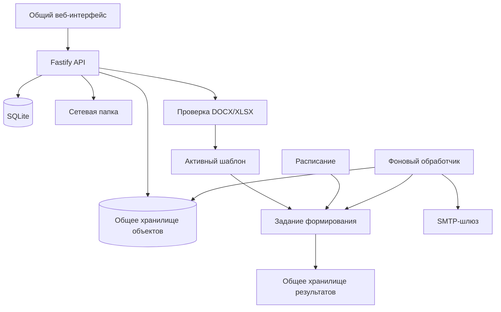

# 🧩 Docomator

**Автономный корпоративный сервис формирования DOCX/XLSX по шаблонам и общим данным — без обязательного доступа в Интернет и без авторизации.**

**Текущее состояние:** работает базовый производственный контур от безопасной загрузки шаблона до ручного или календарного выпуска, общего хранилища результатов, скачивания, сетевой и SMTP-доставки.

**Среда:** Node.js 24 LTS, TypeScript, SQLite, LibreOffice, `llama.cpp`, Debian/Astra Linux, центральный процессор, автономная установка.

> [!IMPORTANT]
> Docomator рассчитан на доверенный внутренний контур. Все пользователи видят общие данные, шаблоны, расписания и готовые документы. Разделы используются для организации участников и процессов, а не для разграничения доступа.

## 🎯 Что уже работает

Пользователь без программирования может:

1. организовать людей и организации по разделам;
2. создавать произвольные типизированные свойства;
3. сохранять группы участников;
4. безопасно загрузить DOCX/XLSX;
5. отметить абзацы DOCX или ячейки XLSX как поля;
6. проверить несколько полей одной окончательной копией;
7. создать PDF-предпросмотр и активировать версию;
8. сформировать один сводный документ;
9. сформировать отдельный документ для каждого участника;
10. увидеть и исправить обязательные пропуски до запуска;
11. получить отдельный файл или ZIP-комплект;
12. повторить только неуспешные документы;
13. сохранить получателей электронной почты;
14. передать результат в разрешённую сетевую папку;
15. отправить результат через SMTP;
16. создать однократное, ежедневное или ежемесячное расписание;
17. автоматически сформировать и отправить документы по сохранённой группе;
18. увидеть новый результат в общем корпоративном хранилище.

## 📥 Общее хранилище документов

Все успешно или частично сформированные результаты — ручные и автоматические — попадают в единый раздел **«Документы»**.

Состояния результата:

```text
Новый → Просмотрен → Забран
                    ↘ Удалён
```

Правила:

- новый результат подсвечивается и увеличивает общий счётчик;
- автоматические документы отмечаются названием расписания и календарным периодом;
- браузер проверяет появление результатов каждые 15 секунд;
- при появлении нового автоматического документа показывается уведомление;
- скачивание переводит результат в состояние «Забран»;
- забранный результат остаётся в истории;
- документ удаляется только отдельным явным действием;
- удалённый результат становится недоступен и через старые ссылки задания;
- неизменяемый объект может физически оставаться в хранилище до отдельной очистки неиспользуемых объектов.

При обновлении существующей установки прежние результаты переносятся как уже просмотренные, поэтому после миграции не возникает ложная очередь новых уведомлений.

## 🔀 Два режима формирования

### Документ на каждого

```text
активный шаблон
+ зафиксированная аудитория N участников
→ N независимых DOCX/XLSX
→ отдельные файлы или ZIP
```

Ошибка одного участника не блокирует остальные документы. После исправления данных можно повторить только проблемные строки.

### Один сводный документ

```text
активный шаблон и его поля
+ аудитория N участников
→ один DOCX/XLSX
→ строка на участника
```

Базовый режим создаёт стандартизированную таблицу. Повторяемая строка внутри произвольного пользовательского макета остаётся следующим расширением компилятора.

## 🔎 Проверка данных перед выпуском

До постановки задания система:

- фиксирует неизменяемый снимок состава;
- получает актуальные свойства каждого участника;
- показывает готовые и отсутствующие обязательные значения;
- позволяет заполнить пропуски на том же экране;
- блокирует неполный сводный выпуск;
- разрешает частичный индивидуальный выпуск.

Поддерживаются строка, длинный текст, число, целое число, логическое значение, дата и дата-время.

## ⏱️ Расписания

Поддерживаются:

- однократный запуск;
- ежедневный запуск;
- ежемесячный запуск с 1-го по 28-е число;
- часовой пояс IANA;
- сохранённая группа;
- активная версия шаблона;
- оба режима формирования;
- автоматическая предварительная проверка;
- ручной запуск без сдвига календаря;
- защита от второго запуска одного периода;
- восстановление незавершённого периода после перезапуска worker;
- необязательная SMTP-доставка сохранённому получателю.

```text
расписание
→ новый снимок группы
→ проверка данных
→ формирование
→ общее хранилище
→ необязательная доставка
```

## 📁 Доставка в сетевую папку

Администратор задаёт разрешённый корень:

```ini
DOCOMATOR_NETWORK_DELIVERY_ROOT=/mnt/company-share/docomator
```

Пользователь задаёт только вложенный каталог. Система запрещает абсолютные пути, `..`, выход за корень и символические ссылки. Запись выполняется атомарно.

## ✉️ SMTP-доставка

Канал выключен до явной настройки:

```ini
DOCOMATOR_SMTP_ENABLED=true
DOCOMATOR_SMTP_HOST=smtp.example.org
DOCOMATOR_SMTP_PORT=587
DOCOMATOR_SMTP_STARTTLS=true
DOCOMATOR_SMTP_FROM=docomator@example.org
DOCOMATOR_SMTP_ALLOWED_DOMAINS=example.org,*.internal.example.org
```

Поддерживаются STARTTLS или неявный TLS, проверка сертификата, AUTH PLAIN/LOGIN только по зашифрованному соединению, повтор временных 4xx-ошибок и стабильный `Message-ID`.

Пароль SMTP не хранится в SQLite и не передаётся браузеру.

## 🛡️ Безопасность документов

До сохранения DOCX/XLSX проверяются:

- сигнатура и структура ZIP;
- размеры, число частей и степень сжатия;
- опасные пути, шифрование и символические ссылки;
- макросы, ActiveX, OLE, подписи и внешние связи;
- запрещённые объявления `DOCTYPE` и `ENTITY`.

Браузер не получает исходный XML. Сервер повторно читает сохранённый исходник и сам разрешает координаты выбранных элементов.

## 🏗️ Архитектура



Проект остаётся модульным монолитом. Redis, RabbitMQ, Kafka, Kubernetes и отдельная векторная база не требуются.

## 🚀 Запуск для разработки

```bash
npm ci
npm run check

export DOCOMATOR_DATA_DIR="$PWD/.tmp/data"
npm run migrate
npm run build
npm run start:api
```

Во втором терминале:

```bash
export DOCOMATOR_DATA_DIR="$PWD/.tmp/data"
npm run start:worker
```

Интерфейс: `http://127.0.0.1:8080/`.

## 📦 Автономная поставка

```bash
sudo scripts/offline/collect-os-packages.sh --apt-update

scripts/offline/prepare-bundle.sh \
  --llama-server /opt/build/llama.cpp/llama-server \
  --model /opt/build/models/model.gguf \
  --os-packages-dir offline-bundles/os-packages
```

Установка:

```bash
tar -xzf docomator-*.tar.gz
cd docomator-*/
sudo ./install.sh --install-os-packages
```

Проверка:

```bash
sudo /opt/docomator/current/first-run.sh \
  --config /etc/docomator/docomator.env \
  --check
```

## 🧱 Ближайшие продуктовые этапы

1. Автоматическая доставка расписаний в сетевую папку.
2. Физическая очистка объектов, на которые больше нет ссылок.
3. Массовый импорт участников и свойств.
4. Пилот на реальных шаблонах и эталонной Astra/Debian.
5. Повторяемая область внутри пользовательского DOCX/XLSX.
6. Предметные события.
7. Локальные агенты ИИ — после стабилизации детерминированного пути.

Подробности: [архитектура](docs/ARCHITECTURE.md), [требования](docs/REQUIREMENTS.md), [план](docs/ROADMAP.md), [ближайшие приращения](docs/NEXT_ITERATIONS.md) и [автономное развёртывание](docs/OFFLINE_DEPLOYMENT.md).
