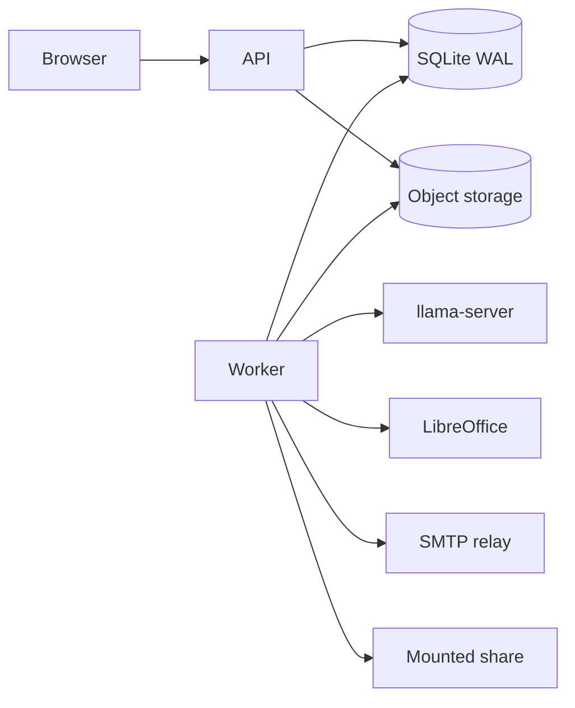
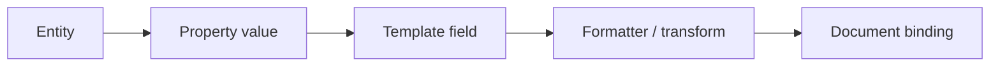
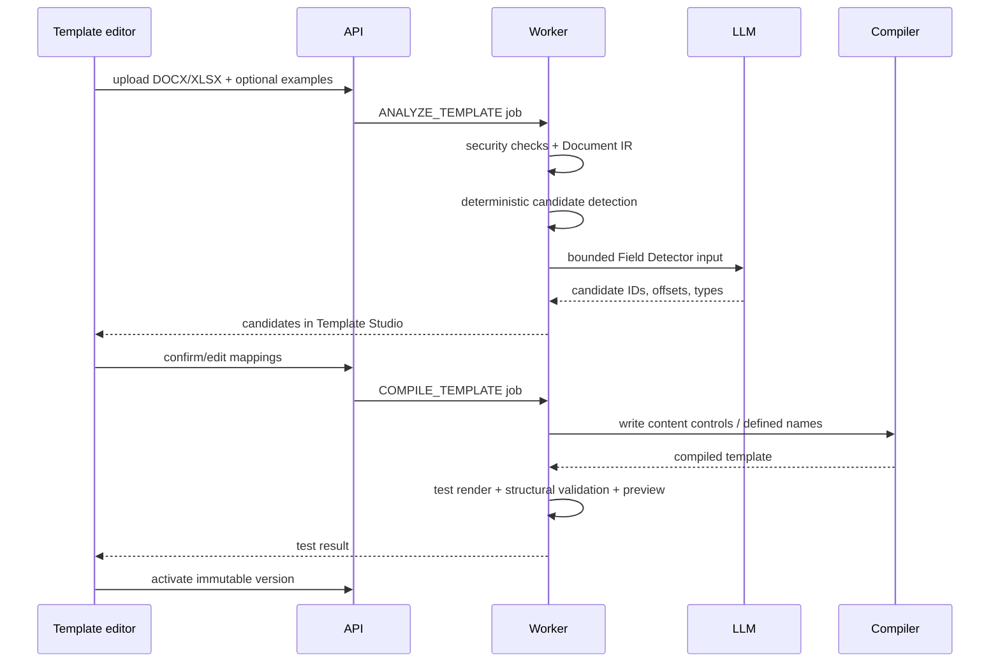
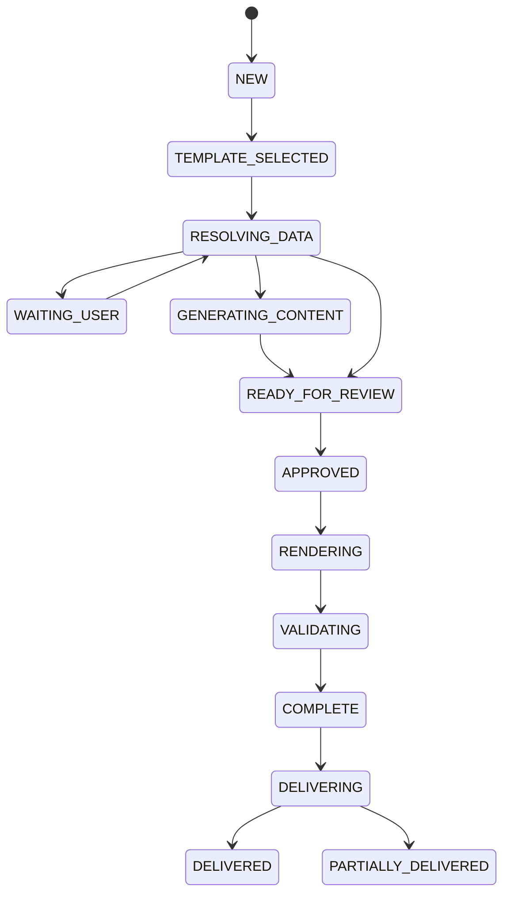

# Архитектура Docomator

Статус: **baseline architecture**
Связанные требования: [REQUIREMENTS.md](REQUIREMENTS.md)

## 1. Архитектурный стиль

Docomator строится как модульный монолит с тремя runtime-процессами:

1. `docomator-api` — HTTP API, аутентификация, CRUD, формы, Template Studio и чтение состояния;
2. `docomator-worker` — очередь, scheduler, events, LLM agents, render, preview и delivery;
3. `docomator-llm` — отдельный `llama-server`, доступный только через localhost.

Файлы хранятся в content-addressed storage, транзакционные метаданные — в SQLite. Тяжёлые операции выполняются worker-ом вне HTTP request lifecycle.



## 2. Доменные модули

| Модуль | Ответственность | Не должен делать |
|---|---|---|
| Identity & Access | пользователи, роли, field-level policies | читать restricted data без policy decision |
| Knowledge Registry | entity types, entities, properties, typed values, provenance | интерпретировать document layout |
| Template Studio | intake, Document IR, field candidates, manual mapping | выполнять production delivery |
| Template Compiler | stable DOCX/XLSX bindings и manifest | генерировать business values |
| Agent Runtime | schema-constrained llama-server calls | иметь side effects во внешних системах |
| Workflow Orchestrator | state machine и dependency graph | редактировать OOXML напрямую |
| Automation Engine | rules, targets, filters, idempotency | хранить timer только в памяти |
| Persistent Scheduler | next run calculation и missed-run policy | создавать duplicate run |
| Render Engine | deterministic DOCX/XLSX patching | выполнять model-generated code |
| Validation & Preview | structural checks, reverse read, PDF preview | считать preview источником истины |
| Delivery Service | archive, SMTP, network share | менять уже утверждённый output |
| Audit | append-only trace и correlation | хранить секреты и raw restricted prompts |

## 3. Слои

```text
HTTP/UI adapters
        ↓
Application services / orchestrators
        ↓
Domain model and policies
        ↓
Ports: repositories, LLM, renderer, preview, delivery
        ↓
Adapters: SQLite, OOXML, llama-server, LibreOffice, SMTP, filesystem
```

Правила зависимостей:

- domain не импортирует Fastify, SQLite, OOXML или SMTP libraries;
- application layer координирует ports и state transitions;
- adapters не принимают policy decisions;
- side effects происходят после явного state transition и записанного idempotency key;
- каждый внешний вызов имеет correlation ID.


### 3.1. Interface architecture

UI является локальным HTTP-адаптером модульного монолита и не принимает доменных решений. Он:

- отображает backend state, а не выводит его из таймеров или предположений;
- использует единую систему design tokens и state components;
- для каждого действия показывает текущий этап, причину ожидания, следующий шаг и recovery action;
- хранит черновое значение формы до подтверждения backend-а;
- передаёт/показывает correlation ID;
- не использует CDN, внешние шрифты, аналитику и удалённые feature flags;
- сохраняет keyboard/mobile/accessibility behavior как часть API-контракта функции.

Полный нормативный контракт: [UX_UI_SPECIFICATION.md](UX_UI_SPECIFICATION.md).

## 4. Универсальная модель данных

### 4.1. Сущность, свойство, поле и привязка



- **Entity** — человек, организация, статья, проект или пользовательский тип.
- **Property definition** — типизированное переиспользуемое определение.
- **Property value** — значение с provenance и периодом действия.
- **Template field** — потребность конкретного документа.
- **Binding** — техническая координата в DOCX/XLSX.

EAV без типов не используется. `value_json` остаётся каноническим сериализованным представлением, а migration `0002_persistence_kernel.sql` добавляет индексируемые typed projection columns. Repository layer обязан валидировать значение через codec registry до записи.

## 5. Document intake и компиляция



LLM не получает бинарный файл. Она получает компактный Document IR и возвращает только существующие IDs/offsets. Backend проверяет координаты до изменения OOXML.

## 6. Рендер DOCX

Основная binding-конструкция — `w:sdt` с tag `aifield:<uuid>`.

Renderer:

1. проверяет manifest и тип значения;
2. находит binding во всех разрешённых Word parts;
3. заменяет только `w:sdtContent`;
4. сохраняет окружающие styles/runs согласно render profile;
5. повторно открывает ZIP и XML;
6. проверяет наличие обязательных bindings и отсутствие markers;
7. выполняет reverse-read ожидаемых значений.

Для повторяющихся строк/блоков используется отдельный structural mode. Макросы, signatures и unsupported objects не должны молча пересобираться.

## 7. Рендер XLSX

Safe patch — режим по умолчанию:

- binding через defined name;
- изменение существующей cell value;
- сохранение остальных OOXML parts;
- metadata на hidden sheet `_AI_META`.

Structural mode применяется только для repeat rows/ranges, insert/delete и новых листов. После structural render обязательны regression test и preview.

## 8. LLM agent runtime

Агент — конфигурация, а не отдельный сервис:

```json
{
  "name": "field-detector",
  "version": 1,
  "inputSchema": "...",
  "outputSchema": "...",
  "temperature": 0,
  "maxTokens": 800,
  "timeoutMs": 60000,
  "retryCount": 1
}
```

Порядок вызова:

```text
prepare minimal context
→ call llama-server with JSON schema
→ validate JSON
→ validate semantic references
→ one repair attempt if needed
→ deterministic fallback or review task
```

Агентам не выдаются credentials, shell, SQL или filesystem tools.

## 9. Document workflow



Только orchestrator изменяет state. Adapter возвращает результат, но не решает следующий переход.

## 10. Automation engine

### 10.1. Правило

Правило содержит:

- trigger: schedule/event/inbox/due-date;
- filter DSL;
- target mode и query/grouping;
- template version policy;
- mappings и defaults;
- missing-data policy;
- review policy;
- delivery definitions;
- retry/retention policy.

### 10.2. Schedule

`next_run_at` хранится в UTC. Расчёт выполняется с IANA timezone и versioned business calendar. При restart применяется `skip`, `run_once` или bounded `catch_up`.

### 10.3. Events и outbox

Business mutation и `domain_events` записываются в одной SQLite transaction. Consumer создаёт `automation_run` с unique idempotency key. Внешний API обязан передавать Idempotency-Key.

### 10.4. Idempotency

Пример ключа:

```text
sha256(rule_id | rule_version | trigger_key | target_key | template_version)
```

Delivery имеет отдельный key, чтобы повторить один канал без повторного render.

## 11. Persistent queue

`worker_jobs` использует состояния `pending`, `running`, `retry`, `completed`, `dead_letter`.

Claim algorithm:

1. короткая `BEGIN IMMEDIATE` transaction;
2. выбрать due job по priority;
3. установить `locked_by`, `locked_at`, `lease_expires_at`, `state=running`;
4. commit;
5. выполнить работу без transaction;
6. зафиксировать результат либо retry.

Worker periodically reclaims expired leases. Завершение и retry требуют действующего lease текущего worker. LLM concurrency по умолчанию — 1. Подробный контракт: [PERSISTENCE_KERNEL.md](PERSISTENCE_KERNEL.md).

## 12. Delivery

### 12.1. Внутренний архив

Output помещается в content-addressed storage до внешней доставки. Delivery работает с immutable file ID и не перегенерирует документ.

### 12.2. SMTP

- локальный SMTP relay;
- deterministic Message-ID;
- allowlisted recipients/domains;
- состояния `accepted_by_smtp`, `rejected`, `unknown`, `failed`;
- controlled retry для `unknown`.

### 12.3. Network folder

- share монтируется ОС;
- root выбирается из allowlist;
- проверяются mountinfo и sentinel;
- имя/path проходит canonicalization и containment check;
- запись: temp in target dir → fsync → rename;
- collision policy фиксируется в delivery result.

## 13. Storage и транзакции

SQLite работает в WAL mode с `foreign_keys=ON`, `busy_timeout` и короткими transactions. Большие файлы не хранятся BLOB-ами. Release и object storage используют SHA-256.

Migrations:

- нумеруются;
- выполняются транзакционно;
- checksum сохраняется в `schema_migrations`;
- применённый файл нельзя менять.

## 14. Offline deployment

```text
/opt/docomator/releases/<version>/
/opt/docomator/current -> releases/<version>
/etc/docomator/docomator.env
/var/lib/docomator/docomator.db
/var/lib/docomator/objects/
/var/lib/docomator/models/
```

Update устанавливает новую immutable release-directory, создаёт backup, применяет migrations, переключает symlink и выполняет readiness check. Ошибка возвращает symlink и database copy.

## 15. Security boundaries

- Browser не обращается к llama-server, SMTP или network shares напрямую.
- LLM не имеет credentials и side-effect tools.
- LibreOffice работает как недоверенный converter в отдельном процессе.
- Загружаемый документ и его инструкции — недоверенные данные.
- Config/secrets не входят в release directories.
- Production releases read-only; writable только data directory.

## 16. Эволюция

Переход к PostgreSQL, отдельному queue broker или нескольким workers допускается после измеренного ограничения SQLite/односерверного deployment. Domain и application ports должны позволить замену adapters без изменения template manifests и требований к idempotency.
