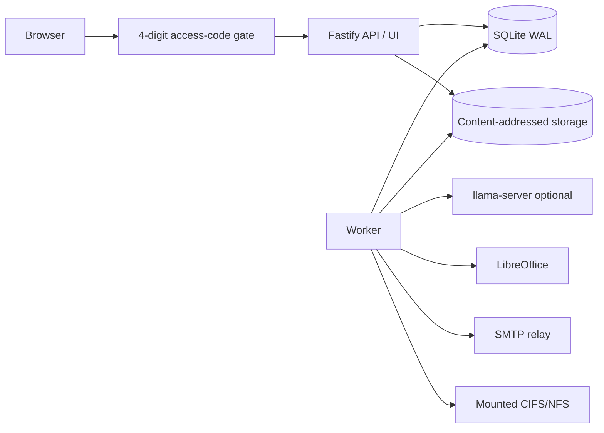

# Архитектура продукта «Оформлятор»

Статус: **baseline architecture**

Связанные документы: [REQUIREMENTS.md](REQUIREMENTS.md), [SECURITY.md](../SECURITY.md), [ADR-0008](adr/0008-space-data-isolation.md), [ADR-0010](adr/0010-public-stateless-document-formatting.md), [ADR-0011](adr/0011-shared-access-code-gate.md).

## 1. Архитектурный стиль

Оформлятор — модульный монолит. Runtime состоит из процессов:

1. `docomator-api` — HTTP API, локальный UI, read/write application services;
2. `docomator-worker` — persisted queue, scheduler, render, preview, delivery и recovery;
3. `docomator-llm` — необязательный `llama-server` только на localhost.

Метаданные хранятся в SQLite WAL, файлы — в content-addressed object store. LibreOffice, LLM, SMTP и network-share operations не выполняются внутри HTTP request transaction.


```mermaid
flowchart LR
    Browser --> Gate[4-digit access-code gate]
    Gate --> API[Fastify API / UI]
    API --> DB[(SQLite WAL)]
    API --> Objects[(Content-addressed storage)]
    Worker --> DB
    Worker --> Objects
    Worker --> Llama[llama-server optional]
    Worker --> Office[LibreOffice]
    Worker --> SMTP[SMTP relay]
    Worker --> Share[Mounted CIFS/NFS]
```

## 2. Граница доверия и код доступа

Действующий ADR-0011 заменяет password/login-семантику ADR-0009:

- один общий код из ровно четырёх цифр;
- username/account/role/ACL отсутствуют;
- `/access` — единственный встроенный экран открытия рабочей области;
- `/api/v1/access/setup|unlock|lock|status` — текущий HTTP contract gate;
- code хранится только как salted scrypt hash;
- session — signed `HttpOnly`, `SameSite=Strict`, при HTTPS `Secure` cookie;
- same-origin mutation и local backoff обязательны;
- встроенный server не использует HTTP Basic Auth и не отдаёт `WWW-Authenticate`.

Code gate — дополнительный барьер внутри trusted workspace, а не самостоятельная security boundary. Firewall/reverse proxy/HTTPS/bind address/system permissions остаются обязательными. `x-actor-id` — непроверенная audit label, а не identity.

Применённая migration `0031_shared_access_password.sql` immutable. Исторические table/column names изолированы внутри access credential adapter. Legacy env/script names допускаются только в compatibility layer update/rollback и не проникают в текущий domain/API/UI.

`/healthz` и `/readyz` публичны для технических checks. Stateless `/gost` следует ADR-0010 и не получает persisted space context.

## 3. Пространства — граница данных

`space` — жёсткая граница пользовательских данных, но не authorization scope. Любой клиент с открытой workspace session может работать с доступными пространствами, однако backend обязан предотвращать смешивание данных независимо от UI.

Не пересекаются:

- entities и employee projections;
- groups и memberships;
- user property definitions/values/history;
- import runs/mapping memory;
- templates, drafts, immutable versions и bindings;
- publications и связанные данные;
- generation jobs/results/deliveries/schedules;
- space-scoped operation/readiness data.

Все mutations получают `spaceId` явно. GET/list/read не меняют ownership. Claim-on-read запрещён. Cross-space link отклоняется до sensitive read, render, LLM или delivery. Database constraints/triggers и application checks дополняют друг друга.

## 4. Универсальная типизированная модель

- `entity_type` — тип объекта;
- `entity` — конкретная запись;
- `space_entity_ownership` — принадлежность одному space;
- `property_definition` — типизированное определение свойства space;
- `entity_property_values` — versioned typed value + provenance;
- `template_field` — потребность конкретного template;
- formatter — declarative versioned display contract;
- binding — validated DOCX/XLSX coordinate.

Кадровый UI — specialised view типа `person`, а не отдельная storage model. Пользовательский field не становится global shared property. Reads не создают и не присваивают property definition.

## 5. Слои и зависимости

```text
HTTP / UI adapters
        ↓
Application services / orchestrators
        ↓
Domain model / policies
        ↓
Ports: repositories, renderer, preview, LLM, delivery
        ↓
Adapters: SQLite, OOXML, llama-server, LibreOffice, SMTP, filesystem
```

Правила:

- domain не импортирует Fastify/SQLite/OOXML/SMTP libraries;
- HTTP handler валидирует boundary input и вызывает application service;
- adapters не принимают product policy decisions;
- side effect начинается только после persisted state transition;
- external side effect имеет correlation ID + idempotency key;
- long-running operations не удерживают DB transaction.

## 6. UI architecture

UI — локальный HTTP adapter, а не второй domain layer.

- `/ui/app.js` начинается с `access-session.js`, который централизованно обрабатывает `401` и controls закрытия session;
- business modules не monkey-patch global fetch для access logic;
- `brand-tokens.css` — единый source visual tokens;
- primary navigation содержит пользовательские задачи, diagnostics/admin — вторичный слой;
- runtime state приходит из backend, а не из фиктивных timers/progress;
- ошибки отвечают: что произошло, сохранены ли данные, что делать дальше;
- forms сохраняют введённое после server error;
- 320 px, 200% zoom, keyboard/focus, dark/light, reduced motion и ≥44px targets — обязательный contract;
- внешние CDN/fonts/analytics/runtime network dependencies запрещены.

Read-only projections (`operations`, data export, help) не создают новую queue/storage truth.

## 7. CSV/XLSX import

Канонический flow:

```text
file/paste → columns → mapping → preview → repair → import → result
```

CSV и XLSX сходятся в одном application contract `headers + rows + mappings + sourceSha256`. XLSX cells сохраняют coordinates; blank cell не сдвигает columns. Error создаётся machine-readable в domain/storage: `code`, scope, physical row, column/property, raw value, severity, repair action/params. UI не восстанавливает semantic regexp-ами из русского message.

Plan/preview не пишет user data. Execute поддерживает partial invalid rows по явной policy, repeat import/idempotent update и negative two-space tests.

## 8. Document intake и Visual Template Studio

DOCX/XLSX считаются untrusted ZIP/XML.

Intake:

1. validate extension/MIME/ZIP shape;
2. enforce compressed/uncompressed limits и actual streamed expanded bytes;
3. reject traversal, duplicate entries, unsupported XML declarations, `DOCTYPE`/`ENTITY`, macros/ActiveX/unsafe relationships by policy;
4. calculate SHA-256 и build deterministic Document IR;
5. save immutable source только после explicit user action.

Visual Template Studio derives bounded read-only projection from immutable source. Он может показывать стили, таблицы, колонтитулы и raster images, но DOM/HTML/CSS никогда не сериализуется обратно в Office. Selection остаётся server-validated coordinate (`elementId + UTF-16 offsets`, cell/range address).

LLM получает только bounded Document IR/candidate IDs и не может создавать произвольные paths, OOXML, SQL или commands.

## 9. Template compiler и renderer

DOCX scalar binding использует разрешённый content-control patching; XLSX scalar binding — validated cell/range/defined-name contracts. Structured repeat blocks явные и versioned.

```text
immutable template version
→ resolve typed values
→ validate required/dependencies
→ deterministic patch allowed bindings only
→ structural validation
→ reverse-read expected values
→ immutable result SHA-256
→ optional LibreOffice preview
→ delivery
```

Renderer сохраняет untouched OOXML parts/styles/tables/headers/footers/formulas в пределах заявленной поддержки. Unsupported construction должна давать limitation/refusal, а не silent corruption. Каждый renderer defect получает minimal fixture + regression test.

## 10. Queue, scheduler и recovery

`worker_jobs` и domain job tables persisted в SQLite. Claim использует short transaction + lease owner/until. Restart возвращает expired lease в queue; idempotency предотвращает второй result.

Retries явные: attempts/nextAttemptAt/lastError. External delivery failure не удаляет generated result. Manual retry обрабатывает только failed units там, где domain contract поддерживает partial success.

Schedules persisted в application storage с timezone/missed-run policy; systemd timer используется для service-level backup, а не user automation.

## 11. Delivery

SMTP: local configured relay, TLS policy, allowlisted recipient domains, bounded attachments и deterministic idempotency/message identity.

Network share: OS-mounted CIFS/NFS, mount + sentinel verification, server-generated safe relative path, temp file on target FS → fsync → atomic rename; fallback write в пустой local mountpoint запрещён.

## 12. Backup, update и rollback

Offline bundle содержит release metadata + SHA manifests, Node runtime, app/workspaces, migrations, optional target-specific OS packages/LibreOffice/LLM, UI и canonical access recovery helpers.

Target install/update network-free:

1. verify ownership/mode и bundle manifest;
2. verify target OS/profile/package closure;
3. backup DB/config before upgrade;
4. install immutable release directory;
5. run migrations;
6. atomically switch `current` symlink;
7. restart services + readiness;
8. rollback symlink/DB/config on failure.

Fresh install создаёт session secret, но не operator code. Update сохраняет credential/session config. `set-access-code.sh`/`reset-access-code.sh` — canonical; password-named scripts — compatibility wrappers only.

Project Control использует тот же native offline bundle/update contract через внешний wrapper и не создаёт второй механизм миграций/rollback.

## 13. Release discipline

`RELEASE_IDENTITY.json` — machine source `version/status/channel`. Product-changing PR bumps SemVer и синхронизирует package metadata/runtime defaults/release docs. Candidate/pilot не является stable.

Перед stable exact release binding проходит full repository CI, Chromium/real-stack/offline archive, clean Debian/Astra target acts, real Office corpus, load 10/100/1000, restart/failure/backup/restore/update/rollback и P5/accessibility с пустыми blockers.
