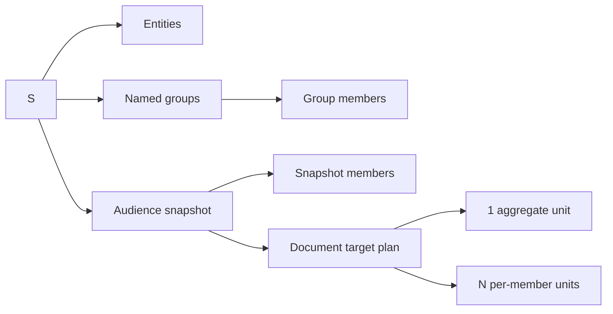

# Пространства, группы и аудитории документов

Статус: **реализованный контракт M1.6**  
Связанные требования: `SPACE-001`—`SPACE-013`, `DOC-011`—`DOC-014`, `AUT-020`—`AUT-022`.

## 1. Зачем нужны пространства

Пространство — историческое имя API для организационного раздела. Раздел может соответствовать подразделению, филиалу, проекту, заказчику или иной области и группирует связанные данные, которые нельзя случайно смешивать ссылками. Он не является границей пользовательского доступа.

Примеры:

```text
Основное пространство
Инженерная служба
Филиал Север
Проект «Альфа»
Внешние рецензенты
```

Каждая сущность принадлежит ровно одному пространству. Типы сущностей и определения свойств являются общей схемой системы, а конкретные люди, организации и другие записи находятся внутри пространства.

> [!IMPORTANT]
> Пространство не является только фильтром интерфейса. Принадлежность хранится в БД, проверяется API и защищена ограничениями и триггерами SQLite. При этом все разделы видимы каждому клиенту, допущенному внешним доверенным периметром.

## 2. Два разных вида участников

В системе различаются:

1. **Клиент приложения** — браузер или иной клиент, допущенный внешним корпоративным периметром. Docomator не создаёт ему локальную учётную запись, роль или членство и показывает все разделы.
2. **Участник документа** — сущность базы знаний, обычно типа `person`. Именно эти записи попадают в группы, выборки, таблицы и документы.

Это разделение обязательно: клиент приложения не обязан быть участником формируемого документа, а человек в документе не становится учётной записью Docomator.

## 3. Модель данных



Основные таблицы:

| Таблица | Назначение |
|---|---|
| `spaces` | Организационные разделы общих данных |
| `space_actor_memberships` | Неиспользуемое наследие неизменяемой миграции 0004 |
| `space_entity_ownership` | Единственное пространство конкретной сущности |
| `audience_groups` | Именованные группы внутри пространства |
| `audience_group_members` | Текущий редактируемый состав группы |
| `audience_snapshots` | Неизменяемый состав конкретного будущего запуска |
| `audience_snapshot_members` | Порядок и отображаемые данные участников на момент снимка |

Для ранее созданных сущностей migration создаёт детерминированное пространство `default`.

## 4. Источники аудитории

Пользователь или правило автоматизации выбирает один источник.

### Все активные участники пространства

```json
{
  "source": {
    "kind": "all_space"
  }
}
```

Допускается ограничение типом сущности:

```json
{
  "source": {
    "kind": "all_space",
    "entityTypeKey": "person"
  }
}
```

### Именованная группа

```json
{
  "source": {
    "kind": "group",
    "groupId": "..."
  }
}
```

Группа редактируема. Для повторяемого результата перед запуском она всегда преобразуется в снимок.

### Отмеченные вручную записи

```json
{
  "source": {
    "kind": "selected",
    "entityIds": ["...", "..."]
  }
}
```

Повторяющиеся ID удаляются с сохранением первого положения. Пустая аудитория отклоняется.

## 5. Режимы результата

### `one_per_member`

Создаётся отдельная единица будущего document job для каждого участника.

```json
{
  "targetMode": "one_per_member",
  "documentCount": 3,
  "units": [
    {
      "primaryEntityId": "person-1",
      "memberIds": ["person-1"],
      "context": {
        "subject": {
          "entityId": "person-1",
          "displayName": "Иванов Иван"
        },
        "audience": {
          "count": 1,
          "members": [
            {
              "entityId": "person-1",
              "displayName": "Иванов Иван"
            }
          ]
        }
      }
    }
  ]
}
```

Применение:

- отдельная справка каждому сотруднику;
- персональное письмо;
- индивидуальная форма;
- комплект документов по каждому участнику.

### `aggregate`

Создаётся одна единица будущего document job. В контексте присутствует упорядоченная коллекция:

```text
audience.members
```

Пример:

```json
{
  "targetMode": "aggregate",
  "documentCount": 1,
  "collectionPath": "audience.members",
  "units": [
    {
      "primaryEntityId": null,
      "memberIds": ["person-1", "person-2", "person-3"],
      "context": {
        "space": {
          "id": "...",
          "key": "engineering",
          "name": "Инженерная служба"
        },
        "audience": {
          "count": 3,
          "members": [
            { "entityId": "person-1", "displayName": "Иванов Иван" },
            { "entityId": "person-2", "displayName": "Петров Пётр" },
            { "entityId": "person-3", "displayName": "Сидорова Анна" }
          ]
        }
      }
    }
  ]
}
```

Template Compiler должен уметь связать `audience.members` с:

- повторяющейся строкой таблицы DOCX;
- повторяющимся абзацем или маркированным списком DOCX;
- повторяющейся строкой/диапазоном XLSX;
- вычисляемым итогом по всей аудитории.

> [!NOTE]
> В M1.6 реализованы выбор, проверка, снимок и target plan. Физический рендер повторяющейся таблицы относится к M3/M6 и в интерфейсе честно помечен следующим этапом.

## 6. Неизменяемый снимок

Снимок хранит:

- пространство;
- источник (`all_space`, `group`, `selected`);
- выбранный режим;
- порядок участников;
- отображаемое имя, тип и статус на момент создания;
- непроверенное обозначение инициатора;
- correlation ID;
- время;
- критерии выбора.

После создания снимок и его состав нельзя обновить. Если состав изменился, создаётся новый снимок.

Это гарантирует:

- воспроизводимость документа;
- корректный аудит;
- отсутствие скрытого изменения запущенной автоматизации;
- возможность объяснить, почему в документ вошёл конкретный человек.

## 7. Целостность разделов

Backend проверяет следующие инварианты:

- сущность принадлежит ровно одному пространству;
- группа принадлежит одному пространству;
- участник группы должен принадлежать тому же пространству;
- участник снимка должен принадлежать пространству снимка;
- API получает `spaceId` в маршруте и не смешивает связанные записи разных пространств;
- перемещение сущности запрещено, пока она входит в именованные группы;
- document job и automation rule имеют ссылку на пространство;
- ID из другого пространства трактуется как отсутствующий ресурс, а не как разрешённая ссылка.

Эти проверки защищают целостность документа и аудитории, а не конфиденциальность от другого пользователя. `GET /api/v1/spaces` всегда возвращает общий каталог без фильтра по `actorId`; маршрутов управления ролями нет.

## 8. REST API

```text
POST /api/v1/spaces
GET  /api/v1/spaces
GET  /api/v1/spaces/:spaceId

POST /api/v1/spaces/:spaceId/entities
GET  /api/v1/spaces/:spaceId/entities
PUT  /api/v1/spaces/:spaceId/entities/:entityId

POST /api/v1/spaces/:spaceId/groups
GET  /api/v1/spaces/:spaceId/groups
PUT  /api/v1/spaces/:spaceId/groups/:groupId/members
GET  /api/v1/spaces/:spaceId/groups/:groupId/members

POST /api/v1/spaces/:spaceId/audience-snapshots
GET  /api/v1/spaces/:spaceId/audience-snapshots
GET  /api/v1/spaces/:spaceId/audience-snapshots/:snapshotId
```

Каждая мутация атомарно записывает:

```text
бизнес-изменение
+ domain event в transactional outbox
+ audit record с correlation ID
```

## 9. Интерфейс

Экран «Пространства» сопровождает пользователя в следующем порядке:

```text
выбор пространства
→ добавление участников
→ отметка нужных людей
→ сохранение группы при необходимости
→ выбор источника аудитории
→ выбор aggregate / one_per_member
→ понятный предварительный расчёт
→ фиксация снимка
→ объяснение будущего числа документов
```

Пользователь всегда видит:

- текущее пространство;
- число участников и групп;
- кого он отметил;
- какой источник используется;
- сколько документов получится;
- будет ли это одна таблица или отдельные документы;
- что уже выполнено;
- какой результат будет сформирован выбранным режимом.

## 10. Автоматизации

Каждое правило автоматизации должно иметь `space_id`. Перед созданием document jobs правило создаёт audience snapshot, а затем использует его target plan.

Это означает:

```text
schedule/event
→ rule scope: one space
→ audience resolution
→ immutable snapshot
→ aggregate or per-member units
→ validation/review
→ render
→ delivery
```

Повтор события с тем же idempotency key должен ссылаться на тот же логический запуск и не создавать второй комплект.
